# Design report — www.gnss.co.il

Measured from the live, rendered site with a real browser (Chromium 141.0.7390.37). Generated 2026-10-05 07:18 UTC by design-extractor 1.0.0.

**Pages:** 9 · **Viewports:** desktop (1440×900), tablet (768×1024), mobile (390×844) · **Title:** ג'נסיס מיתוג ופרסום - משרד הדיגיטל המוביל בישראל | GENESIS

**Built with:** `WordPress 6.9.9` · wordpress, elementor, elementorPro, jquery, gsap, scrollTrigger, animateCss, swiper, lottie, wpRocket, googleFonts, fontAwesome · **widgets:** whatsapp, accessibilityWidget

**Delayed JavaScript:** 69 scripts are held back until the first user interaction (a speed plugin). They were released with a simulated mouse move before measuring, so sticky headers, sliders and animations are measured as a visitor sees them.

**Language / direction:** he-IL / rtl

## Screenshots

| desktop | tablet | mobile |
| --- | --- | --- |
|  |  |  |

Full-page and above-the-fold shots for every page are in `screenshots/<viewport>/`; one image per page section in `sections/`.

## 1. Color

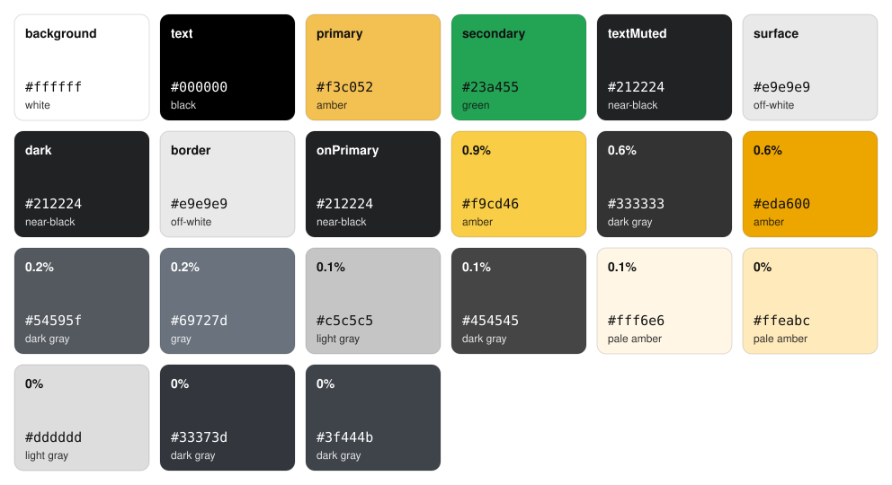

### Roles (inferred from usage)

| role | hex | name | contrast on white |
| --- | --- | --- | --- |
| background | `#ffffff` | white | 1 |
| text | `#000000` | black | 21 |
| primary | `#f3c052` | amber | 1.68 |
| secondary | `#23a455` | green | 3.22 |
| textMuted | `#212224` | near-black | 15.92 |
| surface | `#e9e9e9` | off-white | 1.21 |
| dark | `#212224` | near-black | 15.92 |
| border | `#e9e9e9` | off-white | 1.21 |
| onPrimary | `#212224` | near-black | 15.92 |

### Palette by usage

`share` blends painted area, amount of text and number of elements. Shades that differ by less than ΔE2000 2.3 are merged.

| # | hex | name | share | used for | CSS variables | merged shades | seen on |
| --- | --- | --- | --- | --- | --- | --- | --- |
| 1 | `#ffffff` | white | 42.1% | svg, text, background | --e-global-color-079bc2d, --e-global-color-6609060e, --lightbox-ui-color-hover, --divider-color, --e-form-steps-indicator-inactive-secondary-color, --e-form-steps-indicator-active-secondary-color | #fafafa | body.rtl.home |
| 2 | `#000000` | black | 37% | svg, text, border | --e-global-color-c838d90, --e-global-color-text, --swiper-preloader-color |  | clippath#__lottie_element_2 > rect |
| 3 | `#212224` | near-black | 10.1% | text, svg, background | --e-global-color-primary, --e-global-color-33d69d4, --e-search-form-toggle-color, --image-border-color | #1f2124 | div.elementor-element.e-con-full > div.elementor-element.elementor-view-stacked > div.elementor-icon-wrapper > a.elementor-icon |
| 4 | `#f3c052` | amber | 5.3% | svg, text, background | --e-global-color-accent, --e-global-color-551ec05 | #f9c75b #f2bf52 | div.elementor-element.e-con-full > div.elementor-element.e-con-full > div.elementor-element.e-con-full > div.elementor-element.elementor-headline--style-rotate |
| 5 | `#e9e9e9` | off-white | 2.5% | border, svg, background | --e-global-color-36e2e20, --lightbox-ui-color | #ededed | header.elementor.elementor-10995 > div.elementor-element.e-flex > div > div.elementor-element.e-con-full |
| 6 | `#f9cd46` | amber | 0.9% | svg, text, background | --e-global-color-69b37e0 |  | div.elementor-element.elementor-headline--style-rotate > h2.elementor-headline > span.elementor-headline-dynamic-wrapper.elementor-headline-text-wrapper > span.elementor-headline-dynamic-text.elementor-headline-text-active |
| 7 | `#333333` | dark gray | 0.6% | svg, text |  |  | div.elementor-icon-wrapper > a.elementor-icon > svg > path |
| 8 | `#eda600` | amber | 0.6% | svg |  |  | g > g > g > path |
| 9 | `#54595f` | dark gray | 0.2% | border, text | --e-global-color-secondary |  | div.elementor-widget-wrap.elementor-element-populated > div.elementor-element.elementor-widget-divider--view-line > div.elementor-divider > span.elementor-divider-separator |
| 10 | `#69727d` | gray | 0.2% | border |  |  | input#form-field-Fname |
| 11 | `#c5c5c5` | light gray | 0.1% | border |  |  | h3#ui-id-1 |
| 12 | `#454545` | dark gray | 0.1% | text |  |  | h3#ui-id-1 |
| 13 | `#fff6e6` | pale amber | 0.1% | svg |  |  | g > g > g > path |
| 14 | `#ffeabc` | pale amber | 0% | background |  |  | div > div.elementor-element.e-con-full > a.elementor-element.e-con-full > div.elementor-element.e-con-full |
| 15 | `#23a455` | green | 0% | background | --e-global-color-123f0643 |  | body.rtl.home > footer.elementor.elementor-3630 > div.elementor-element.elementor-hidden-desktop |
| 16 | `#dddddd` | light gray | 0% | border |  |  | div#ui-id-2 |
| 17 | `#33373d` | dark gray | 0% | floating widget · svg |  |  | div.elementor-element.elementor-nav-menu__align-start > div.elementor-menu-toggle > svg > path |
| 18 | `#3f444b` | dark gray | 0% | background |  |  | nav.elementor-nav-menu--dropdown.elementor-nav-menu__container > ul.elementor-nav-menu.sm-vertical > li.menu-item.menu-item-type-post_type > a.elementor-item.elementor-item-active |

### Translucent colors (overlays, scrims, shadows)

| rgba | used for |
| --- | --- |
| `rgba(0, 0, 0, 0.251)` | shadow |
| `rgba(243, 192, 82, 0.878)` | pseudo |
| `rgba(237, 237, 237, 0.902)` | svg |

### Gradients

| gradient | count | on |
| --- | --- | --- |
| `linear-gradient(249deg, #212224 0%, #000000 100%)` | 30 | box |
| `linear-gradient(90deg, #ffffff00 0%, #ffffff 100%)` | 2 | box |
| `linear-gradient(90deg, #ffffff 0%, #ffffff00 100%)` | 2 | box |
| `linear-gradient(#9687ff00 0%, #ffffff 100%)` | 2 | box |

### Color variables declared in CSS

| variable | value |
| --- | --- |
| `--swiper-theme-color` | `#007aff` |
| `--e-global-color-c838d90` | `#000` |
| `--e-global-color-123f0643` | `#23A455` |
| `--e-global-color-36e2e20` | `#E9E9E9` |
| `--e-global-color-54d6f101` | `#80CAD6` |
| `--e-global-color-primary` | `#212224` |
| `--e-global-color-f0409db` | `#8D008D` |
| `--e-global-color-79d00aa` | `#22ABC8` |
| `--e-global-color-33d69d4` | `#212224` |
| `--e-global-color-079bc2d` | `#FFFFFF` |
| `--e-global-color-7f8312aa` | `#7A7A7A` |
| `--e-global-color-text` | `#000000` |
| `--e-global-color-69b37e0` | `#F9CD46` |
| `--e-global-color-accent` | `#F3C052` |
| `--e-global-color-secondary` | `#54595F` |
| `--e-global-color-6609060e` | `#FFF` |
| `--e-global-color-551ec05` | `#F3C05200` |
| `--lightbox-ui-color` | `#ededede6` |
| `--lightbox-ui-color-hover` | `#ffffff` |
| `--swiper-preloader-color` | `#000000` |
| `--divider-color` | `#ffffff` |
| `--e-form-steps-indicator-inactive-secondary-color` | `#ffffff` |
| `--e-form-steps-indicator-active-secondary-color` | `#ffffff` |
| `--e-form-steps-indicator-completed-secondary-color` | `#ffffff` |
| `--e-search-form-toggle-color` | `#212224` |
| `--image-border-color` | `#2121211f` |
| `--border-color` | `#c9cdd5` |

## 2. Typography

| family | share of text | weights used | source | loaded faces | rendered as |
| --- | --- | --- | --- | --- | --- |
| `Anomalia` | 100% | 100, 300, 400, 500, 600, 700, 800, 900 | self-hosted (@font-face) | 400, 100, 800, normal | Anomalia ML v2 AAA, Anomalia ML v2 AAA Light |

### Text roles per viewport

| role | desktop | tablet | mobile | color | sample |
| --- | --- | --- | --- | --- | --- |
| h1 | 700 54px/1.2 Anomalia also 127px/800, 84px/700 | 700 54px/1.2 Anomalia also 94px/800, 84px/700 | 700 25px/1.2 Anomalia also 44px/800, 20px/700 | #000000 | מיתוג עסקי |
| h2 | 700 45px/1.1 Anomalia also 23px/100, 98px/700 | 700 45px/1.1 Anomalia also 23px/100, 98px/700 | 700 25px/1.1 Anomalia also 42px/700, 54.4px/300 | #212224 | יחד, ניצור שפה לעסק שלך |
| h3 | 700 28px/1.2 Anomalia also 25px/700, 30px/600 | 700 28px/1.2 Anomalia also 45px/700, 30px/600 | 700 28px/1.2 Anomalia also 22px/700, 30px/600 | #212224 | 5.0 |
| h4 | 700 20px/1 Anomalia | 700 20px/1 Anomalia | 700 22px/1 Anomalia | #212224 | האם אתם עובדים גם עם עסקים קטנים? |
| lead | — | 400 20px/1.3 Anomalia | 400 17px/1.5 Anomalia |  |  |
| body | 300 22px/1.5 Anomalia also 17px/400, 20px/400, 17px/700 | 300 18px/1.5 Anomalia also 17px/400, 20px/400, 17px/700 | 300 15px/1.5 Anomalia also 17px/400, 16px/400, 18px/300 | #000000 | הרעיון בג׳נסיס הוא לספק מעטפת מלאה עבור כל שירותי המיתוג והשיווק שהעס… |
| small | 400 17px/1.5 Anomalia | 400 17px/1.5 Anomalia | — | #000000 | זה המניע העיקרי שמזיז אותנו. לדחוף את העסקים שעובדים איתנו קדימה – לה… |
| nav | 700 24px/1 Anomalia | — | — | #000000 |  |
| button | 400 19px Anomalia · ls 1.9px · uppercase | 400 23px Anomalia | 400 19px Anomalia | #212224 |  |
| input | 400 20px Anomalia | 400 20px Anomalia | 400 20px Anomalia | #000000 |  |
| footerLink | 400 17px/1.18 Anomalia | 400 17px/1.18 Anomalia | 400 17px/1.18 Anomalia | #ffffff |  |

### Type scale (desktop)

| size | weight | family | line-height | share | used as | sample |
| --- | --- | --- | --- | --- | --- | --- |
| 239px | 700 | Anomalia | 239px (1) | 0% | div | עבו |
| 216px | 700 | Anomalia | 216px (1) | 0% | div | הצצה לתיק |
| 198px | 700 | Anomalia | 237.6px (1.2) | 0% | h2 | רציני? |
| 127px | 800 | Anomalia | 114.3px (0.9) | 0.1% | h1 | ברוכים הבאים למשרד |
| 103px | 300 | Anomalia | 103px (1) | 0.2% | h2 | לקוחות ממליצים |
| 98px | 700 | Anomalia | 98px (1) | 0.3% | h2 | פורצים קדימה, לוקחים אחריות, והכל בבית אחד |
| 98px | 900 | Anomalia | 98px (1) | 0% | h2 |  |
| 84px | 700 | Anomalia | 84px (1) | 0.1% | h1 | ברוכים הבאים לתיק העבודות שלנו.מוזמנים לבחור קטגוריה ולהתרשם |
| 79px | 400 | Anomalia | 79px (1) | 0.1% | h2 | לקשר רציני? |
| 79px | 700 | Anomalia | 79px (1) | 0.1% | h2 | מוכנים |
| 60px | 300 | Anomalia | 60px (1) | 0.1% | h3 | מיתוג עסקי |
| 59px | 700 | Anomalia | 59px (1) | 0% | div | 342 |
| 57px | 400 | Anomalia | 57px (1) | 1.4% | div | ניהול קמפיינים |
| 54px | 700 | Anomalia | 64.8px (1.2) | 0.4% | h1, h2 | מיתוג עסקי |
| 50px | 700 | Anomalia | 50px (1) | 0.1% | h2 | יצירת בידול |
| 45px | 700 | Anomalia | 49.5px (1.1) | 3.4% | h2 | יחד, ניצור שפה לעסק שלך |
| 45px | 700 | Anomalia | 45px (1) | 0.1% | h2, h3 | שאלות ותשובות |
| 44px | 800 | Anomalia | 44px (1) | 0% | button | שליחה |
| 40px | 700 | Anomalia | 40px (1) | 0.2% | a | 077-9972792 |
| 30px | 700 | Anomalia | 30px (1) | 0.7% | div, h3 | ניווט באתר |
| 30px | 600 | Anomalia | 6px (0.2) | 0.3% | h3 | הגדרת תכונות המותג |
| 30px | 600 | Anomalia | 30px (1) | 0% | h3 | עיצוב לוגו וגיבוש קונספט ויזואלי |
| 30px | 600 | Anomalia | 33px (1.1) | 0% | h3 | קמפיין שיווק חוזר - ReTargeting |
| 28px | 300 | Anomalia | 42px (1.5) | 0.6% | p, a | לפגישת ייעוץ ללא התחייבות השאר פרטים עכשיו או התקשרו: |

Most common line-height ratios: 1.5 (71.9%), 1.3 (10%), 1 (9.5%), 1.1 (3.5%), 1.18 (3.3%), 1.2 (1.4%)

### Design variables declared by the site (typography, spacing, radius…)

Builders such as Elementor (`--e-global-typography-*`) and WordPress (`--wp--preset--*`) store the official design tokens here.

| variable | value |
| --- | --- |
| `--swiper-navigation-size` | `44px` |
| `--e-global-typography-5a6e74e-font-family` | `"Anomalia"` |
| `--e-global-typography-e906feb-font-family` | `"Anomalia"` |
| `--e-global-typography-04a6833-font-family` | `"Anomalia"` |
| `--e-global-typography-69bb92a-line-height` | `0.8em` |
| `--e-global-typography-b672ae1-font-family` | `"Anomalia"` |
| `--e-global-typography-d44a458-font-size` | `25px` |
| `--e-global-typography-5a6e74e-font-weight` | `normal` |
| `--e-global-typography-fd7bee3-line-height` | `1.2em` |
| `--e-global-typography-ce83f4b-line-height` | `1.3em` |
| `--e-global-typography-69bb92a-font-size` | `48px` |
| `--e-global-typography-951a772-font-family` | `"Anomalia"` |
| `--e-global-typography-d44a458-font-weight` | `normal` |
| `--e-global-typography-1f787f0-font-family` | `"Anomalia"` |
| `--e-global-typography-7365e77-font-size` | `22px` |
| `--e-global-typography-c15befe-font-weight` | `normal` |
| `--e-global-typography-951a772-line-height` | `1.1em` |
| `--e-global-typography-03d612f-font-family` | `"Anomalia"` |
| `--e-global-typography-024b716-font-size` | `22px` |
| `--e-global-typography-b672ae1-font-weight` | `300` |
| `--e-global-typography-024b716-font-family` | `"Anomalia"` |
| `--e-global-typography-secondary-font-weight` | `600` |
| `--e-global-typography-b672ae1-line-height` | `1.2em` |
| `--e-global-typography-9b4a378-font-family` | `"Anomalia"` |
| `--e-global-typography-4aababf-font-size` | `24px` |
| `--e-global-typography-c15befe-font-size` | `17px` |
| `--e-global-typography-af50a56-font-family` | `"Anomalia"` |
| `--e-global-typography-04a6833-font-weight` | `500` |
| `--e-global-typography-b672ae1-font-size` | `15px` |
| `--e-global-typography-62817ed-font-weight` | `bold` |
| `--e-global-typography-primary-font-family` | `"Anomalia"` |
| `--e-global-typography-accent-font-weight` | `bold` |
| `--e-global-typography-04a6833-font-size` | `22px` |
| `--e-global-typography-7365e77-font-weight` | `300` |
| `--e-global-typography-69bb92a-letter-spacing` | `1px` |
| `--e-global-typography-primary-font-weight` | `bold` |
| `--e-global-typography-62817ed-line-height` | `1.1em` |
| `--e-global-typography-127bdd7-letter-spacing` | `0.5px` |
| `--e-global-typography-4aababf-font-family` | `"Anomalia"` |
| `--e-global-typography-03d612f-font-size` | `35px` |
| `--e-global-typography-127bdd7-font-family` | `"Anomalia"` |
| `--e-global-typography-2f65b2c-font-family` | `"Anomalia"` |
| `--e-global-typography-7365e77-font-family` | `"Anomalia"` |
| `--e-global-typography-af50a56-font-weight` | `bold` |
| `--e-global-typography-1f787f0-font-weight` | `bold` |
| `--e-global-typography-03d612f-font-weight` | `normal` |
| `--e-global-typography-e906feb-font-size` | `18px` |
| `--e-global-typography-9116715-font-size` | `15px` |
| `--e-global-typography-c9a7542-font-family` | `"Anomalia"` |
| `--e-global-typography-d44a458-font-family` | `"Anomalia"` |
| `--e-global-typography-ce83f4b-font-weight` | `normal` |
| `--e-global-typography-69bb92a-font-family` | `"Anomalia"` |
| `--e-global-typography-secondary-font-family` | `"Anomalia"` |
| `--e-global-typography-text-font-weight` | `normal` |
| `--e-global-typography-d44a458-line-height` | `1.2em` |
| `--e-global-typography-c9a7542-line-height` | `1em` |
| `--e-global-typography-ce83f4b-font-size` | `20px` |
| `--e-global-typography-af50a56-font-size` | `27px` |
| `--e-global-typography-62817ed-font-size` | `45px` |
| `--e-global-typography-c15befe-font-family` | `"Anomalia"` |

## 3. Spacing & layout

- **Spacing base unit:** irregular (no single base unit)
- **Common spacing values:** 2px, 3px, 4px, 5px, 6px, 8px, 10px, 12px, 14px, 15px, 16px, 20px, 24px, 30px, 32px, 50px, 64px, 124px
- **Content container:** 1392px (centered widths: 1392px×126, 1340px×90, 742px×66, 1380px×24, 1372px×22, 1400px×17)
- **max-width values:** 100%×702, min(100%, 1570px)×139, 60%×10, 40%×10, 1570px×3, 1365px×1, 1366px×1, 882px×1
- **Section vertical padding:** desktop 10px · tablet 46px · mobile 46px
- **Typical section height:** desktop 678px · tablet 939px · mobile 679px
- **Gaps:** 15px, 5px, 32px, 64px, 24px, 30px, 10px, 12px · **Section columns:** 1 col×70, 2 col×42, 3 col×4, 20 col×1, 4 col×10, 6 col×1 · **Layout engines:** flex 1156, grid 113

## 4. Shape — radius, shadow, border

| radius | count | used on | example |
| --- | --- | --- | --- |
| `16px` | 100 | box, link | div > div.elementor-element.e-flex > div > div.elementor-element.e-con-full |
| `pill (≥ half height)` | 89 | box, button, link | header.elementor.elementor-10995 > div.elementor-element.e-flex > div > div.elementor-element.e-con-full |
| `6px` | 12 | box | search > form.elementor-search-form > div.elementor-search-form__toggle > div.e-font-icon-svg-container |
| `32px` | 11 | box | div.elementor-element.e-flex > div > div.elementor-element.e-con-full > div.elementor-element.e-flex |
| `50%` | 9 | button | div.elementor-element.e-con-full > div.elementor-element.elementor-view-stacked > div.elementor-icon-wrapper > a.elementor-icon |
| `3px` | 6 | heading, link | h3#ui-id-3 |
| `50px` | 2 | link | div.elementor-element.e-grid > div.elementor-element.e-con-full > div.elementor-element.elementor-align-right > a.elementor-button.elementor-button-link |
| `3px 3px 0px 0px` | 2 | heading | h3#ui-id-1 |
| `0px 0px 3px 3px` | 2 | box | div#ui-id-2 |

| box-shadow | count | used on |
| --- | --- | --- |
| `#00000040 2px 5px 10px -5px` | 11 | link, button |

| border | count | used on |
| --- | --- | --- |
| `1px solid #e9e9e9` | 417 | box, link |
| `2px solid #000000` | 336 | box |
| `1px solid #000000` | 59 | button |
| `1px solid #69727d` | 52 | input |
| `1px solid #ffffff` | 52 | button |
| `1px solid #54595f` | 50 | box |
| `2px solid #212224` | 33 | input |
| `1px solid #c5c5c5` | 30 | heading |
| `1px solid #dddddd` | 6 | box |
| `1px solid #212224` | 4 | link |

| filter / backdrop-filter | count | on |
| --- | --- | --- |
| `grayscale(1)` | 6 | media |
| `drop-shadow(rgba(0, 0, 0, 0.3) 1px 0px 6px)` | 4 | media |

## 5. Breakpoints

Strategy: **desktop-first (max-width queries dominate)**

| query | rules inside |
| --- | --- |
| max-width: 99999px | 17 |
| max-width: 1440px | 36 |
| min-width: 1367px | 34 |
| max-width: 1366px | 3293 |
| min-width: 1025px | 80 |
| max-width: 1024px | 4787 |
| min-width: 1024px | 96 |
| min-width: 768px | 1352 |
| max-width: 767px | 9835 |
| max-width: 600px | 77 |
| max-width: 530px | 78 |
| max-width: 480px | 311 |
| min-width: 480px | 16 |
| max-width: 479px | 21 |

Other media features: print (179), prefers-reduced-motion (99)

## 6. Components

### Header

- **desktop:** height 110px · position `static` (pinned: fixed) · bg `#ffffff` · border-bottom `1px solid #e9e9e9` · sticky on scroll: **yes** · logo 200×27 svg
  - painted bar: 1392×74 · inset 24px sides / 24px top · radius `50px` · border `1px solid #e9e9e9` · padding `0px 8px 0px 16px`
  - 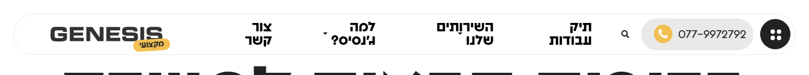 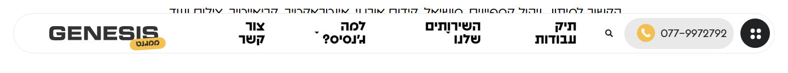
- **tablet:** height 111px · position `static` (pinned: fixed) · bg `#ffffff` · border-bottom `1px solid #e9e9e9` · sticky on scroll: **yes** · logo 190×25 svg
  - painted bar: 720×75 · inset 24px sides / 24px top · radius `50px` · border `1px solid #e9e9e9` · padding `8px 16px 8px 16px`
  - 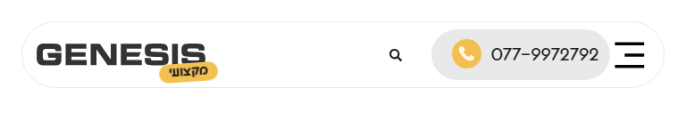 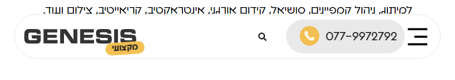
- **mobile:** height 84px · position `static` (pinned: fixed) · bg `#ffffff` · border-bottom `1px solid #e9e9e9` · sticky on scroll: **yes** · logo 148×20 svg
  - painted bar: 358×60 · inset 16px sides / 12px top · radius `50px` · border `1px solid #e9e9e9` · padding `8px 16px 8px 16px`
  - 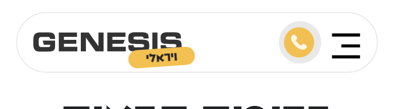 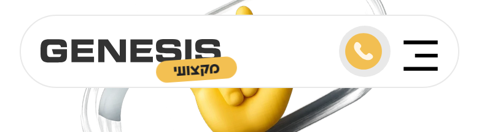
- **Navigation:** 2 links (תיק עבודות · צור קשר) · 700 24px/24 Anomalia · none · color `#000000` · gap ≈ —px · padding `0px 0px 0px 0px`
- **Header CTAs:** , 077-9972792
- **Phone in header:** 077-9972792, tel:0779972792
- social icons: 6 · search: yes · cart: no
- **Mobile menu:** opens a panel — `fixed` 390×844, bg `#000000cc`, links 400 27px/40.5 Anomalia · none 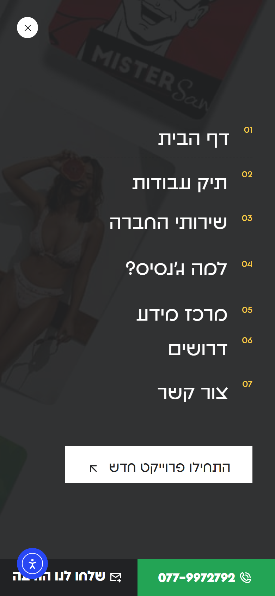

### Buttons

| # | preview | background | text | border | radius | font | padding | height | count | labels | hover |
| --- | --- | --- | --- | --- | --- | --- | --- | --- | --- | --- | --- |
| 1 | 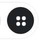 | `#212224` | `#ffffff` | `none` | 50% (pill) | 400 27px Anomalia | `14px 14px 14px 14px` | 54px | 9 |  | color: #ffffff → #f3c052; borderTopColor: #ffffff → #f3c052; borderBottomColor: #ffffff → #f3c052; outlineColor: #ffffff → #f3c052; icon.color: #ffffff → #f3c052; icon.borderTopColor: #ffffff → #f3c052; icon.borderBottomColor: #ffffff → #f3c052; icon.outlineColor: #ffffff → #f3c052 |
| 2 | 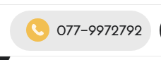 | `#e9e9e9` | `#212224` | `none` | 50px (pill) | 100 23px Anomalia | `12px 12px 12px 12px` | 57px | 9 | 077-9972792 |  |
| 3 | 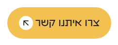 | `#f3c052` | `#212224` | `none` | 50px (pill) | 400 21px Anomalia | `18px 24px 18px 24px` | 65px | 7 | צרו איתנו קשר / ליצירת קשר עם יועץ שיווק |  |
| 4 |  | `#f3c052` | `#212224` | `none` | 0px (square) | 400 19px Anomalia uppercase | `5px 5px 5px 5px` | 51px | 6 | עיצוב לוגו / מודעות סושיאל / מודעות קמפיינים |  |
| 5 |  | `#212224` | `#ffffff` | `1px solid #ffffff` | 50px (pill) | 800 44px Anomalia | `22px 32px 22px 32px` | 90px | 6 | שליחה |  |
| 6 | 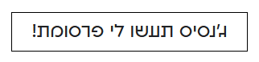 | `transparent` | `#212224` | `1px solid #000000` | 0px (square) | 400 23px Anomalia | `12px 24px 12px 24px` | 49px | 5 | ג'נסיס תעשו לי פרסומת! / דברו איתנו / בקרו באתר | color: #212224 → #f3c052; backgroundColor: #21222400 → #54595f00; borderTopColor: #000000 → #f9cd46; borderBottomColor: #000000 → #f9cd46; outlineColor: #212224 → #f3c052; text.color: #212224 → #f3c052; text.borderTopColor: #212224 → #f3c052; text.borderBottomColor: #212224 → #f3c052; text.outlineColor: #212224 → #f3c052 |
| 7 |  | `transparent` | `#212224` | `1px solid #000000` | 0px (square) | 500 22px Anomalia | `10px 50px 10px 50px` | 44px | 3 | 1. בידול / 2. מיתוג וקריאייטיב / 3. פרסום וניהול קמפיינים​ |  |
| 8 | 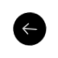 | `#000000` | `#ededede6` | `none` | 50px (pill) | 400 25px Anomalia | `8px 8px 8px 8px` | 44px | 2 |  | color: #ededede6 → #f3c052; borderTopColor: #ededede6 → #f3c052; borderBottomColor: #ededede6 → #f3c052; outlineColor: #ededede6 → #f3c052; icon.color: #ededede6 → #f3c052; icon.borderTopColor: #ededede6 → #f3c052; icon.borderBottomColor: #ededede6 → #f3c052; icon.outlineColor: #ededede6 → #f3c052 |
| 9 |  | `#212224` | `#ededede6` | `none` | 0px (square) | 400 25px Anomalia | `12px 12px 12px 12px` | 49px | 2 |  |  |
| 10 |  | `#f3c052` | `#ffffff` | `none` | 0px (square) | 700 23px Anomalia | `15px 30px 15px 30px` | 47px | 2 | שליחה |  |

Hover — before → after:

- variant 1: 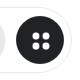 → 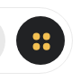
- variant 2: 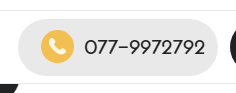 → 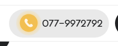
- variant 3: 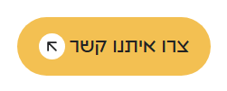 → 
- variant 6: 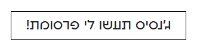 → 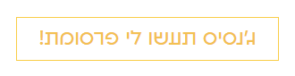
- variant 8: 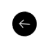 → 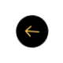
- variant 9:  → 

### Links

| region | color | decoration | weight | size | samples | hover |
| --- | --- | --- | --- | --- | --- | --- |
| footer | `#ffffff` | none | 400 | 17px | מיתוג עסקי / השירותים שלנו / מי אנחנו? / מרכז מידע |  |
| main | `#f3c052` | none | 300 | 22px | חברת הפרסום ג’נסיס / ahrefs / שיווק באינטרנט / המיתוג העסקי |  |
| nav | `#212224` | none | 700 | 24px | תיק עבודות / צור קשר | color: #000000 → #f3c052; borderTopColor: #000000 → #f3c052; borderBottomColor: #000000 → #f3c052; outlineColor: #000000 → #f3c052 |
| footer | `#f3c052` | none | 700 | 40px | 077-9972792 |  |
| footer | `#f3c052` | none | 400 | 17px | לח"י 25, בני ברק (בית שקד) \| … |  |
| nav | `#212224` | none | 400 | 14px | מיתוג עסקי |  |
| main | `#f3c052` | none | 300 | 28px | 077-9972792 |  |
| main | `#212224` | none | 300 | 60px | מיתוג עסקי ג'נסיס מתמחה ביציר… / קידום אתרים שידחוף אתכם חזק ק… / ניהול רשתות חברתיות טיפול איש… / בניית אתרים מומחים בבניית כל … |  |
| main | `#f3c052` | none | 400 | 18px | בסטל'ה / רמי לוי ביטוח / פספורטוגו – PASSPORTOGO / ביתא נדל"ן |  |
| main | `#f9cd46` | none | 300 | 15px | מרכז מידע שיווק באמצעות תוכן … / מרכז מידע גוגל מיי ביזנס: איך… / מרכז מידע ג'נסיס מיתוג ופרסום… |  |

### Form fields

| type | height | background | border | bottom border | radius | font | placeholder color | padding | count | examples |
| --- | --- | --- | --- | --- | --- | --- | --- | --- | --- | --- |
| text | 42px | `transparent` | `none` | `2px solid #212224` | 0px | 17px Anomalia | `#000000` | `8px 16px 8px 16px` | 18 | איך קוראים לך? / מה הטלפון שלך? / תחום עיסוק? |
| text | 47px | `#ffffff` | `1px solid #69727d` | `1px solid #69727d` | 0px | 20px Anomalia | `#000000` | `6px 16px 6px 16px` | 7 | שם מלא / טלפון / תחום עיסוק? / איך קוראים לך? / מה הטלפון שלך? |

### Cards & repeated items

| page | preview | items | per row | size | surface | radius | shadow | image | heading | hover |
| --- | --- | --- | --- | --- | --- | --- | --- | --- | --- | --- |
| 01-home |  | 20 | 20 | 299×531 | `#000000` | 0px | — |  |  |  |
| 03-שירות-מיתוג-עסקי |  | 6 | 2 | 466×272 | `none` | — | — |  | 600 30px/30 Anomalia · none "עיצוב לוגו וגיבוש קונספט ויזואלי" |  |
| 03-שירות-מיתוג-עסקי |  | 5 | 2 | 466×195 | `none` | — | — |  | 600 30px/6 Anomalia · none "ניהול רשת חברתית" |  |
| 03-שירות-מיתוג-עסקי |  | 3 | 3 | 447×601 | `none` | — | — | 400×513 (0.78) fill |  |  |
| 03-שירות-מיתוג-עסקי |  | 3 | 2 | 444×170 | `none` | — | — |  | 600 30px/6 Anomalia · none "הגדרת תכונות המותג" |  |

### Footer

- **desktop:** 400px · bg `#212224` · text `#ffffff` `#333333` `#f3c052` `#f9cd46` · 4 columns · headings 700 30px/30 Anomalia · none · links 400 17px/20 Anomalia · none `#ffffff` · social icons 1 · “© כל הזכויות שמורות 2026”
- **tablet:** 604px · bg `#212224` · text `#ffffff` `#333333` `#f3c052` `#f9cd46` · 4 columns · headings 700 30px/30 Anomalia · none · links 400 17px/20 Anomalia · none `#ffffff` · social icons 1 · “© כל הזכויות שמורות 2026”
- **mobile:** 1716px · bg `#212224` · text `#ffffff` `#333333` `#f3c052` `#f9cd46` · 1 columns · headings 700 30px/30 Anomalia · none · links 400 17px/20 Anomalia · none `#ffffff` · social icons 1 · “© כל הזכויות שמורות 2026”

### Popups & banners (hidden before capture)

| kind | covers | text | seen on | shot |
| --- | --- | --- | --- | --- |
| modal | 100% | ליצירת קשר עם יועץ מקצועי השאירו פרטים וניצור איתכם קשר בהקדם: שם מלא טלפון תחום עיסוק? שליחה | 10 views (01-home/desktop, 01-home/mobile, 02-תיק-עבודות-3/desktop…) | [view](components/overlay-01-home-desktop-late.jpg) |

### Images & icons

- 89 images (desktop, all pages) · aspect: square-ish 56, panorama (>2.2) 26, 16:9-ish 3, portrait 3:4 3, 4:3-ish 1 · object-fit: fill 82, cover 6, contain 1 · image radius: 0px ×89
- 10 CSS background images · filters: `grayscale(1)`
- icons: Anomalia ×7, specific-custom-icon ×1 · 250 inline SVGs (common sizes 152x35, 24x24, 15x15, 14x14, 27x27, 25x25)
- embeds: video cdn.gnss.co.il, video cdn.gnss.co.il, video cdn.gnss.co.il, video dvision.co.il, video cdn.gnss.co.il, video www.gnss.co.il autoplay, video cdn.gnss.co.il, video cdn.gnss.co.il, video cdn.gnss.co.il, video cdn.gnss.co.il, video cdn.gnss.co.il, video cdn.gnss.co.il

## 7. Motion & interaction

- **Libraries:** gsap, scrollTrigger, animateCss, swiper, lottie
- **Durations:** 0.3s ×5452, 0.4s ×1553, 0.1s ×37, 0.2s ×18, 0.5s ×17, 1s ×12 · **Easings:** `ease` ×7081, `cubic-bezier(0, 0.33, 0.07, 1.03)` ×12
- **Entrance animations (elementor):** motion-fx: scrolling ×40, sticky: top ×19, fadeIn ×10, fadeInUp ×4
- **Running CSS animations:** `fadeIn 0.35s ease` ×16, `elementor-headline-drop-in-in 0.8s ease` ×10, `spin-pulse 5s ease-in-out infinite` ×9, `marquee-left 200s linear infinite` ×8, `marquee-right 200s linear infinite` ×8, `fadeInUp 0.75s ease` ×3, `slideInUp 1.25s ease` ×1, `fadeInUp 1.25s ease` ×1
- **@keyframes defined:** fa-spin, swiper-preloader-spin, eicon-spin, hide-scroll, elementor-headline-dash, hide-highlight, elementor-headline-flip-in, elementor-headline-flip-out, elementor-headline-pulse, elementor-headline-swirl-in, elementor-headline-swirl-out, elementor-headline-slide-down-in, elementor-headline-slide-down-out, elementor-headline-drop-in-in, elementor-headline-drop-in-out, elementor-headline-blinds-in, elementor-headline-blinds-out, elementor-headline-wave-up, elementor-headline-wave-down, elementor-headline-slide-in, elementor-headline-slide-out, fadeInUp, fadeInLeft, fadeIn, spin-pulse, marquee-left, marquee-right, slideInRight, loadingOpacityAnimation, fadeOut

| transition | count | on |
| --- | --- | --- |
| `background 0.3s ease` | 1411 | box, link, button |
| `border 0.3s ease` | 1411 | box, link, button |
| `box-shadow 0.3s ease` | 1411 | box, link, button |
| `transform 0.4s ease` | 1373 | box, link, button |
| `border-radius 0.3s ease` | 925 | box, widget |
| `all 0.3s ease` | 272 | box, button, input |
| `all 0.4s ease` | 180 | link |
| `transform 0.1s ease` | 37 | box |
| `all 0.2s ease` | 18 | box |
| `fill 0.3s ease` | 12 | media |
| `width 0.5s ease` | 10 | box |
| `color 0.3s ease` | 10 | box |
| `all 0.5s ease` | 7 | box, media |
| `transform 1s cubic-bezier(0, 0.33, 0.07, 1.03)` | 6 | box |

### Measured hover effects

| element | label | what changes |
| --- | --- | --- |
| button 1 | ג'נסיס תעשו לי פרסומת! | color: #212224 → #f3c052; backgroundColor: #21222400 → #54595f00; borderTopColor: #000000 → #f9cd46; borderBottomColor: #000000 → #f9cd46; outlineColor: #212224 → #f3c052; text.color: #212224 → #f3c052; text.borderTopColor: #212224 → #f3c052; text.borderBottomColor: #212224 → #f3c052; text.outlineColor: #212224 → #f3c052 |
| button 2 |  | color: #ededede6 → #f3c052; borderTopColor: #ededede6 → #f3c052; borderBottomColor: #ededede6 → #f3c052; outlineColor: #ededede6 → #f3c052; icon.color: #ededede6 → #f3c052; icon.borderTopColor: #ededede6 → #f3c052; icon.borderBottomColor: #ededede6 → #f3c052; icon.outlineColor: #ededede6 → #f3c052 |
| button 4 |  | color: #ffffff → #f3c052; borderTopColor: #ffffff → #f3c052; borderBottomColor: #ffffff → #f3c052; outlineColor: #ffffff → #f3c052; icon.color: #ffffff → #f3c052; icon.borderTopColor: #ffffff → #f3c052; icon.borderBottomColor: #ffffff → #f3c052; icon.outlineColor: #ffffff → #f3c052 |
| button 7 | דברו איתנו, נעשה את זה יחד | color: #ffffff → #f3c052; backgroundColor: #21222400 → #54595f00; borderTopColor: #ffffff → #f9cd46; borderBottomColor: #ffffff → #f9cd46; outlineColor: #ffffff → #f3c052; text.color: #ffffff → #f3c052; text.borderTopColor: #ffffff → #f3c052; text.borderBottomColor: #ffffff → #f3c052; text.outlineColor: #ffffff → #f3c052 |
| nav-link 1 | תיק עבודות | color: #000000 → #f3c052; borderTopColor: #000000 → #f3c052; borderBottomColor: #000000 → #f3c052; outlineColor: #000000 → #f3c052 |

## 8. Page layouts

### 01-home — ג'נסיס מיתוג ופרסום - משרד הדיגיטל המוביל בישראל | GENESIS

https://www.gnss.co.il/ · page height desktop 15766px · tablet 20217px · mobile 15963px

| # | kind | height (desk / mob) | background | padding-y | columns | align | heading | shot |
| --- | --- | --- | --- | --- | --- | --- | --- | --- |
| 1 | header | 110 / — | `#ffffff` | 0 / 0 | 1 | start | H2 23px 100 “077-9972792” |  |
| 2 | hero | 573 / 597 | `#ffffff` | 0 / 0 | 2 (47.4/26.2%) | center | H1 127px 800 “ברוכים הבאים למשרד הדיגיטל המוביל בישראל” | 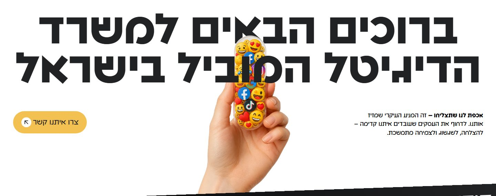 |
| 3 | content | 157 / — | `linear-gradient(249deg, #212224 0%, #000000 100%)` | 10 / 10 | 2 (16.5/17.6%) | — |  | 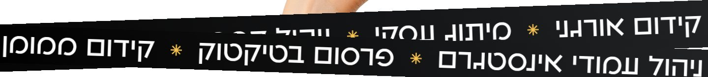 |
| 4 | content | 129 / — | `linear-gradient(249deg, #212224 0%, #000000 100%)` | 10 / 10 | 1 | — |  | 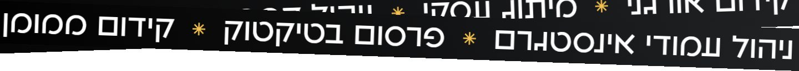 |
| 5 | logos | 1253 / 821 | `#ffffff` | 0 / 0 | 1 | center | H2 98px 700 “פורצים קדימה, לוקחים אחריות, והכל בבית אחד.” | 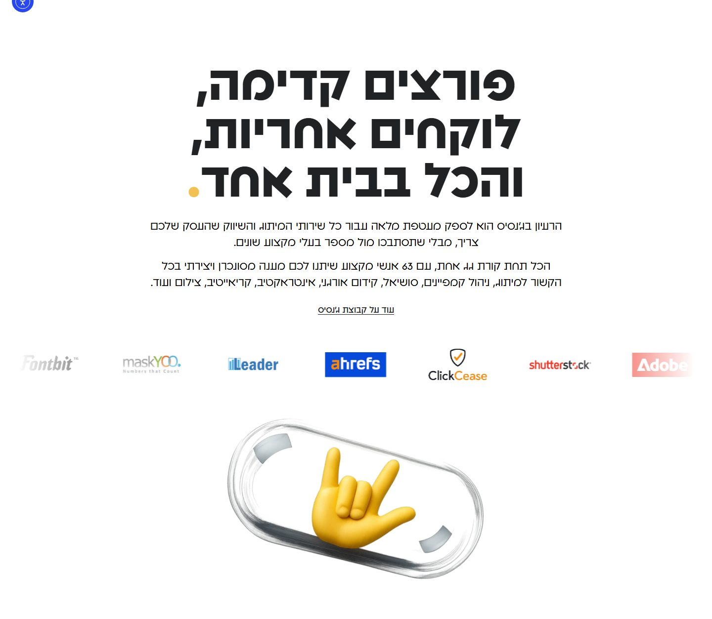 |
| 6 | content | 1109 / 1392 | `#ffffff` | 0 / 0 | 1 | center | H2 98px 700 “יש סיבות טובות לבחור בנו” | 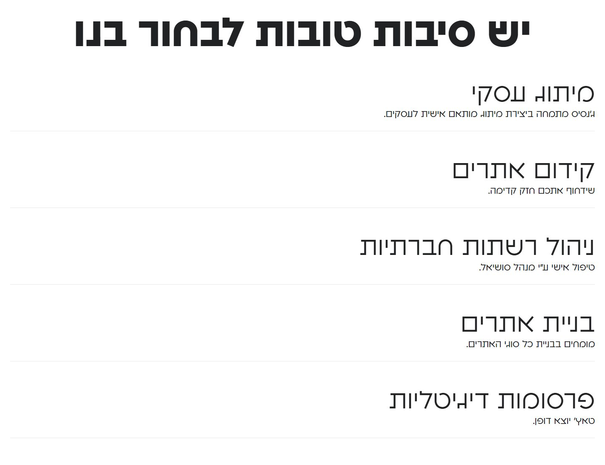 |
| 7 | content | 20 / — | `#ffffff` | 10 / 10 | 1 | — |  | 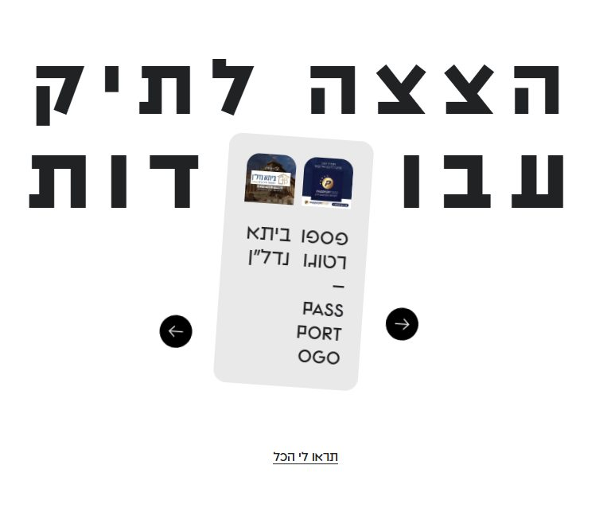 |
| 8 | carousel | 896 / 712 | `#ffffff` | 0 / 0 | 3 (30.9/26.8/30%) | start | H3 25px 400 “בסטל'ה” | 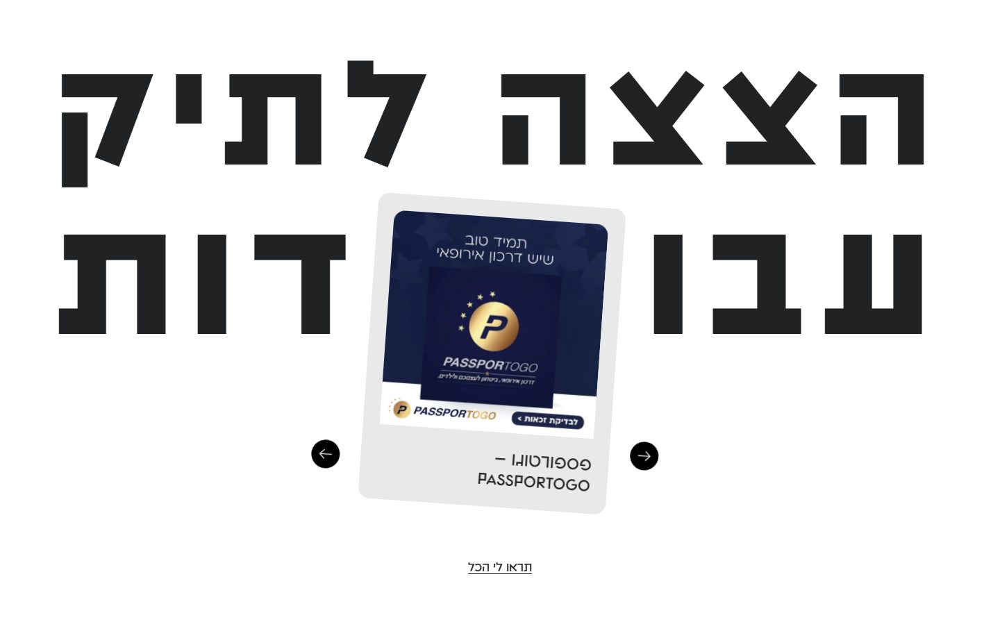 |
| 9 | testimonials | 1722 / 1516 | `#ffffff` | 0 / 0 | 1 | start | H2 103px 300 “לקוחות ממליצים” | 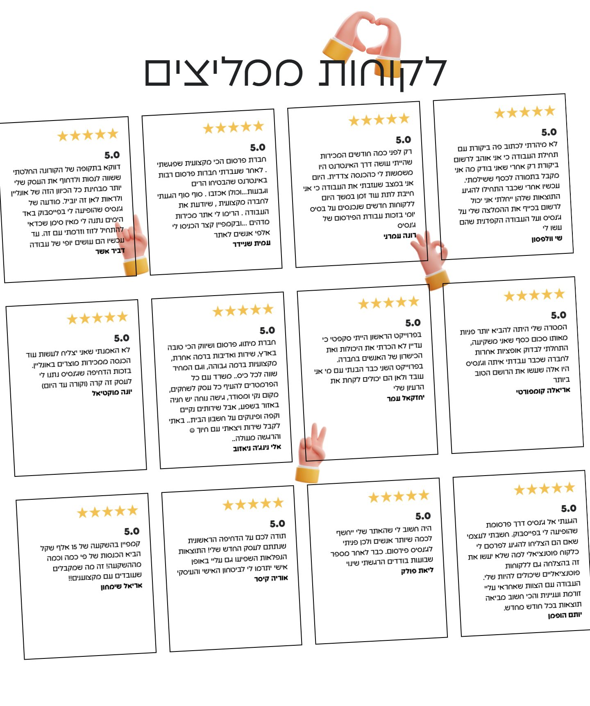 |
| 10 | carousel | 1166 / 1130 | `#ffffff` | 0 / 0 | 20 (20.7/20.7/20.7/20.7/20.7/20.7/20.7/20.7/20.7/20.7/20.7/20.7/20.7/20.7/20.7/20.7/20.7/20.7/20.7/20.7%) | center | H2 98px 700 “מה ה-story שלך!?” | 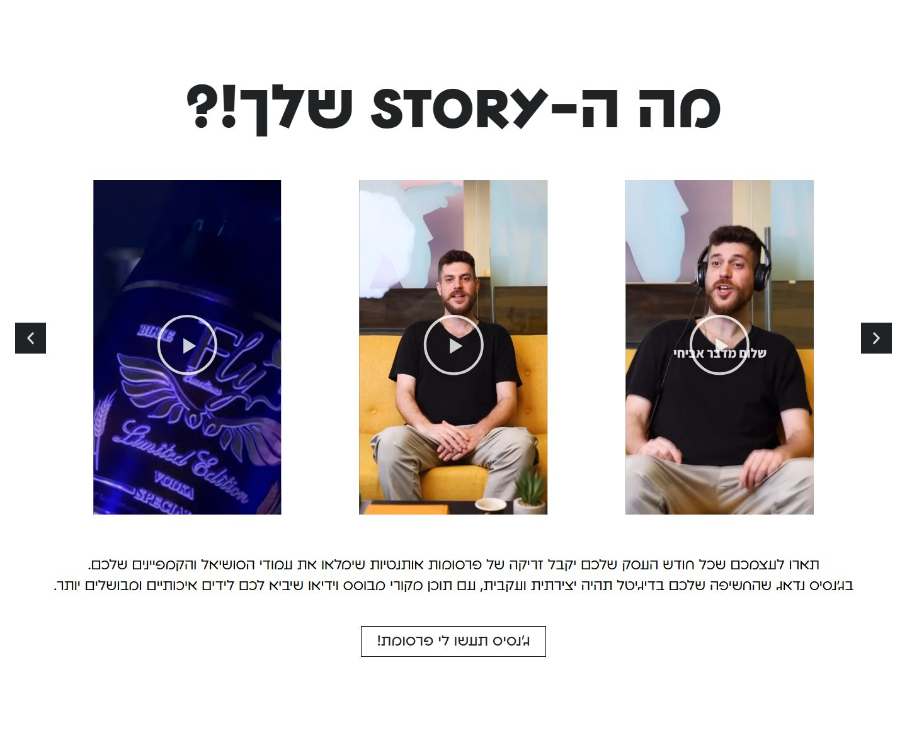 |
| 11 | grid/cards | 900 / 844 | `#212224` | 0 / 0 | 3 (10.1/10.1/10.1%) | center | H2 198px 700 “מוכנים לקשר רציני?” | 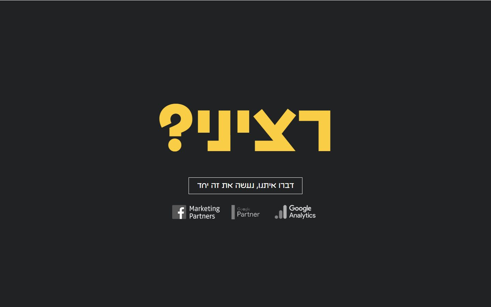 |
| 12 | content | 1010 / 692 | `#ffffff` | 0 / 0 | 1 | center | H2 98px 700 “עבודה עם מערכות AI” | 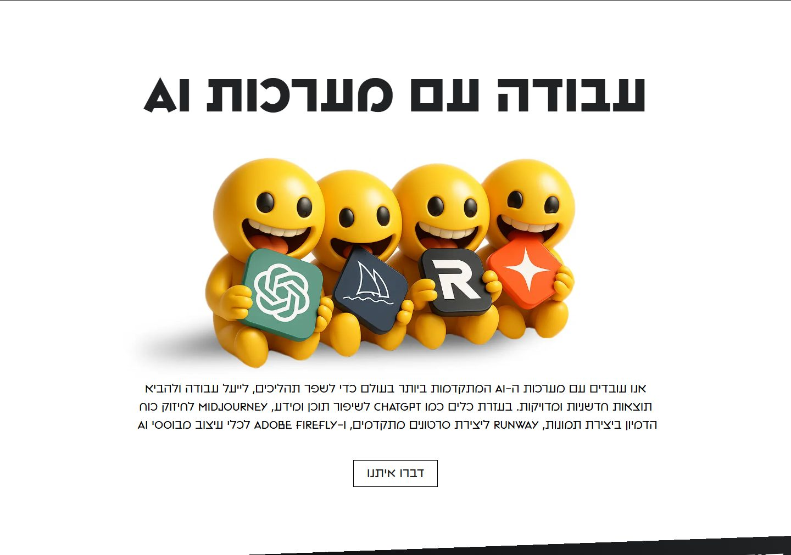 |
| 13 | content | 157 / — | `linear-gradient(249deg, #212224 0%, #000000 100%)` | 10 / 10 | 2 (16.5/17.6%) | — |  | 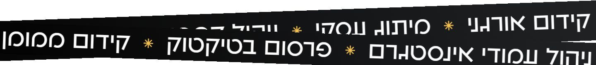 |
| 14 | content | 132 / — | `linear-gradient(249deg, #212224 0%, #000000 100%)` | 10 / 10 | 1 | — |  | 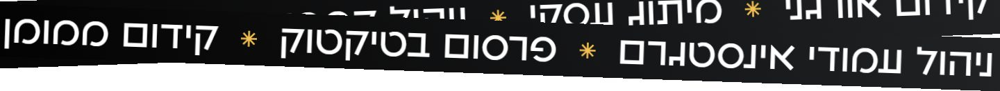 |
| 15 | grid/cards | 1257 / 835 | `#ffffff` | 0 / 0 | 4 (14.1/14.1/14.1/14.1%) | center | H2 98px 700 “המחלקות שלנו, המקצוענים שלכם.” | 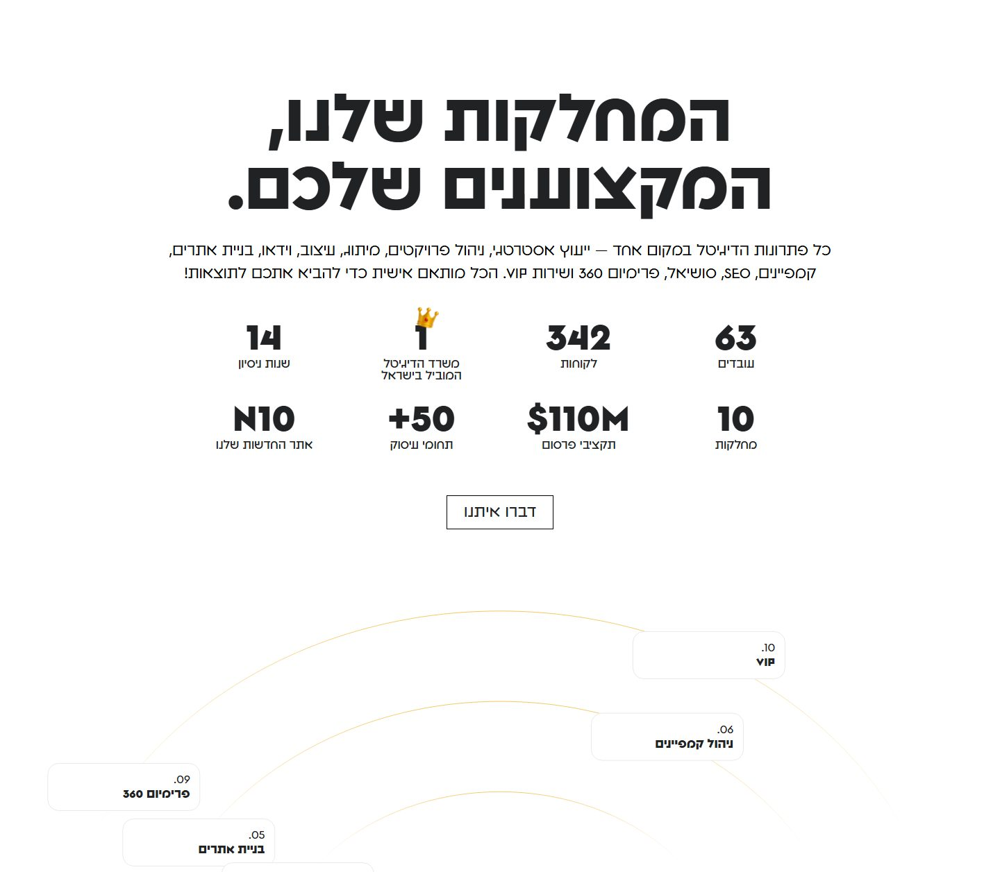 |
| 16 | content | 727 / 646 | `#fafafa` | 0 / 0 | 2 (58/38.7%) | start | H2 98px 700 “אתר המדיה החדשני שלנו” | 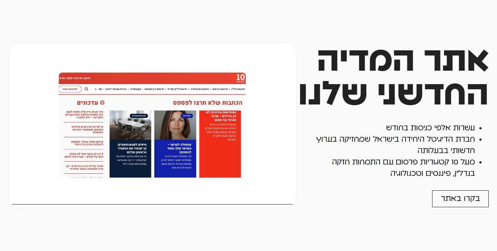 |
| 17 | grid/cards | 1281 / 1676 | `#ffffff` | 0 / 0 | 3 (25.1/37.6/25.1%) | start | H2 98px 700 “הטיפים החדשים ביותר בעולם הדיגיטל” | 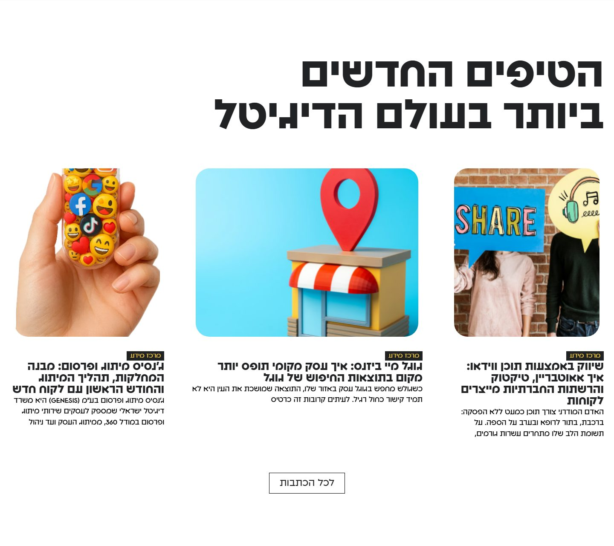 |
| 18 | content | 3005 / 3054 | `#ffffff` | 64 / 124 | 1 | start | H3 45px 700 “שאלות ותשובות” | 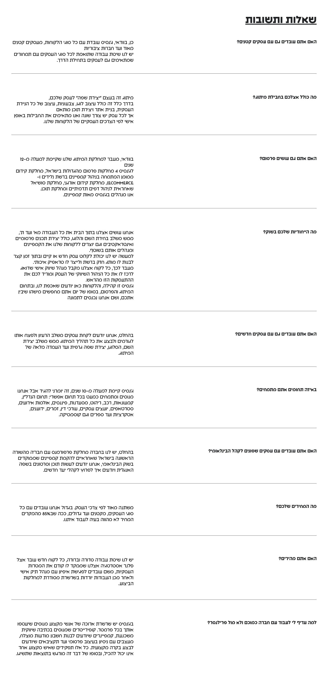 |
| 19 | footer | 400 / — | `#212224` | 0 / 0 | 4 (27.9/21.7/21.7/21.7%) | start |  | 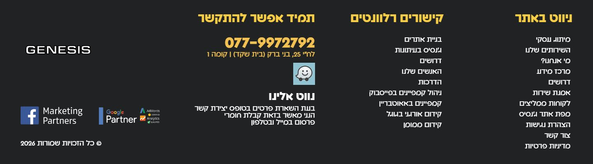 |

Text outline: [pages/01-home.md](pages/01-home.md)

### 02-תיק-עבודות-3 — תיק העבודות המלא שלנו: בואו להתרשם ממאות העבודות שכבר עשינו | ג'נסיס

https://www.gnss.co.il/%d7%aa%d7%99%d7%a7-%d7%a2%d7%91%d7%95%d7%93%d7%95%d7%aa-3/ · page height desktop 1104px · tablet 1699px · mobile 2310px

| # | kind | height (desk / mob) | background | padding-y | columns | align | heading | shot |
| --- | --- | --- | --- | --- | --- | --- | --- | --- |
| 1 | header | 110 / — | `#ffffff` | 0 / 0 | 1 | start | H2 23px 100 “077-9972792” |  |
| 2 | content | 258 / 190 | `#ffffff` | 0 / 0 | 1 | start | H1 84px 700 “ברוכים הבאים לתיק העבודות שלנו. מוזמנים לבחור קטגוריה ולהתרש” | 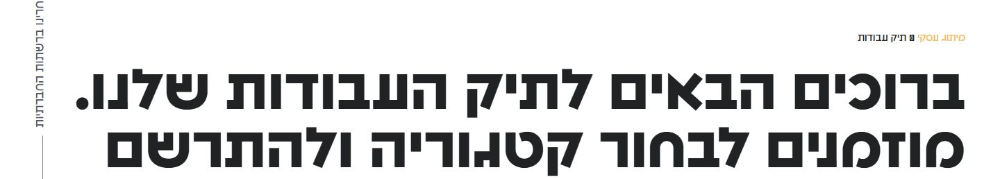 |
| 3 | grid/cards | 336 / — | `#ffffff` | 32 / 219 | 6 (14.9/14.9/14.9/14.9/14.9/14.9%) | — |  | 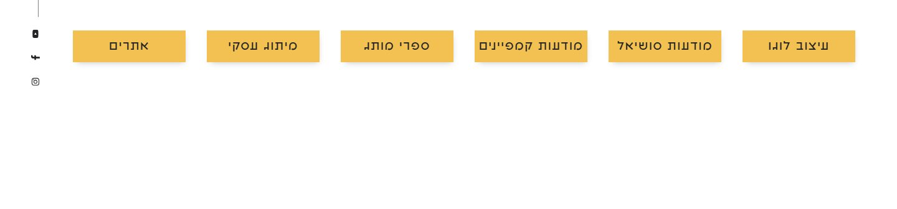 |
| 4 | footer | 400 / — | `#212224` | 0 / 0 | 4 (27.9/21.7/21.7/21.7%) | start |  | 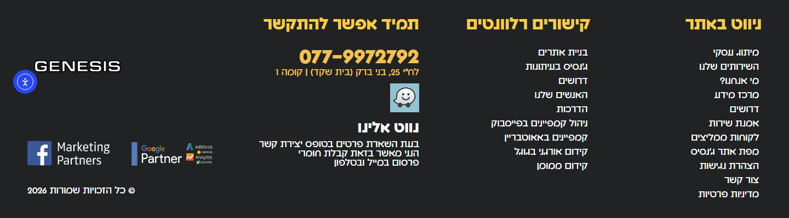 |

Text outline: [pages/02-תיק-עבודות-3.md](pages/02-תיק-עבודות-3.md)

### 03-שירות-מיתוג-עסקי — מיתוג עסקי שיוביל אתכם לפריצה עסקית? קבלו 3 שלבים מנצחים | ג׳נסיס

https://www.gnss.co.il/%d7%a9%d7%99%d7%a8%d7%95%d7%aa-%d7%9e%d7%99%d7%aa%d7%95%d7%92-%d7%a2%d7%a1%d7%a7%d7%99/ · page height desktop 9844px · tablet 13102px · mobile 14932px

| # | kind | height (desk / mob) | background | padding-y | columns | align | heading | shot |
| --- | --- | --- | --- | --- | --- | --- | --- | --- |
| 1 | header | 110 / — | `#ffffff` | 0 / 0 | 1 | start | H2 23px 100 “077-9972792” | 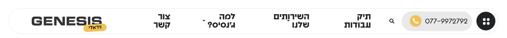 |
| 2 | hero | 715 / 635 | `#ffffff` | 0 / 0 | 1 | center | H1 54px 700 “מיתוג עסקי” | 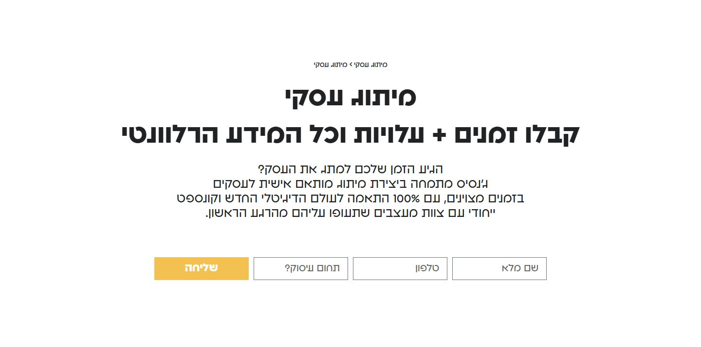 |
| 3 | grid/cards | 725 / — | `#ffffff` | 0 / 0 | 3 (31/31/31%) | — |  | 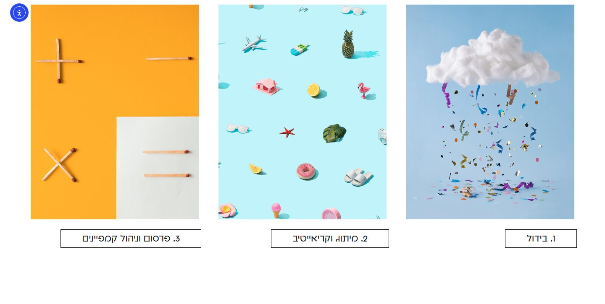 |
| 4 | content | 639 / 942 | `#ffffff` | 0 / 0 | 2 (64.7/27.7%) | start | H2 50px 700 “יצירת בידול” | 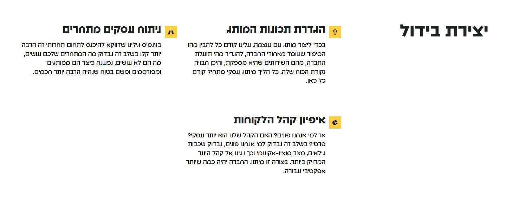 |
| 5 | content | 1138 / 2274 | `#ffffff` | 0 / 0 | 2 (64.7/27.7%) | start | H2 50px 700 “מיתוג וקריאייטיב” | 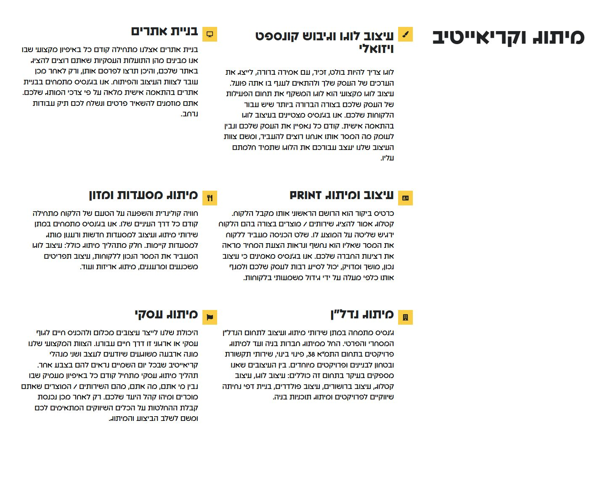 |
| 6 | content | 914 / 1605 | `#ffffff` | 0 / 0 | 2 (64.7/27.7%) | start | H2 50px 700 “פרסום וניהול קמפיינים” | 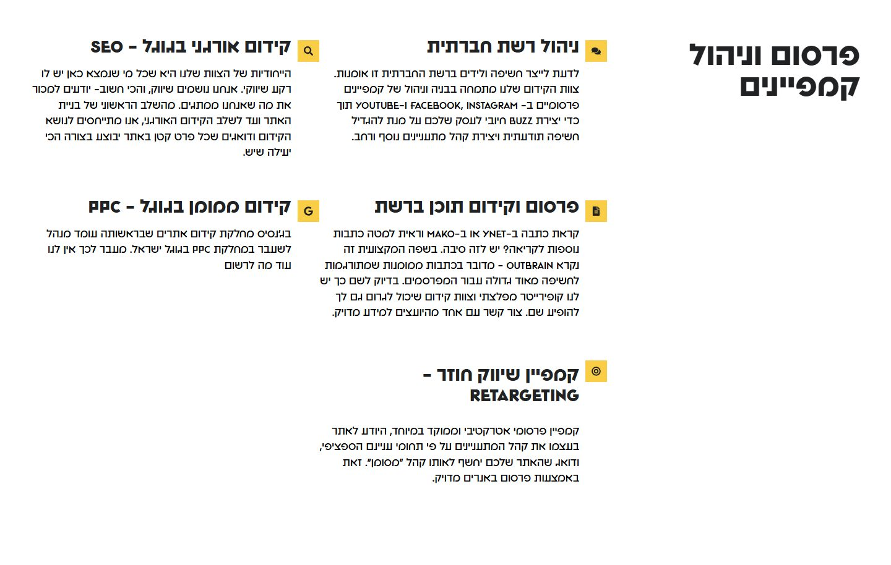 |
| 7 | content | 678 / 675 | `#ffffff` | 0 / 0 | 2 (47.8/48.3%) | start | H2 45px 700 “יחד, ניצור שפה לעסק שלך” | 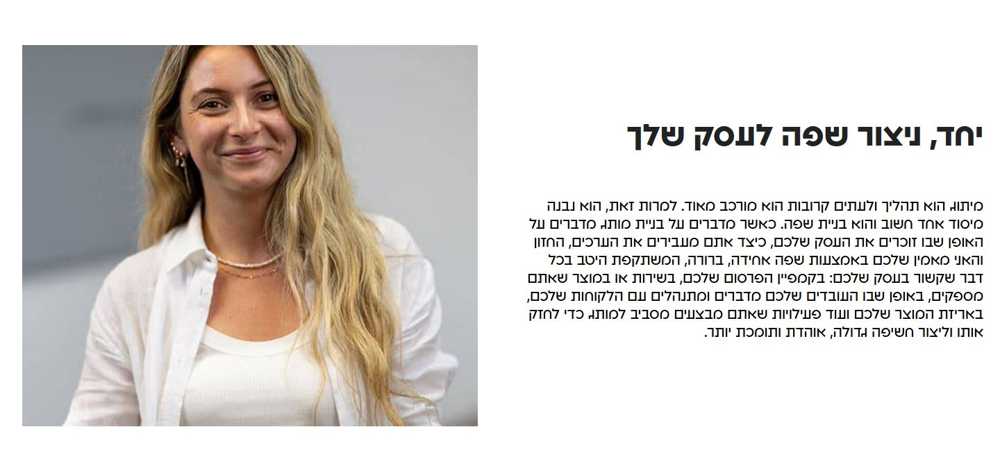 |
| 8 | content | 678 / 655 | `#ffffff` | 0 / 0 | 2 (48.3/47.8%) | start | H2 45px 700 “איך בונים מותג חזק?” | 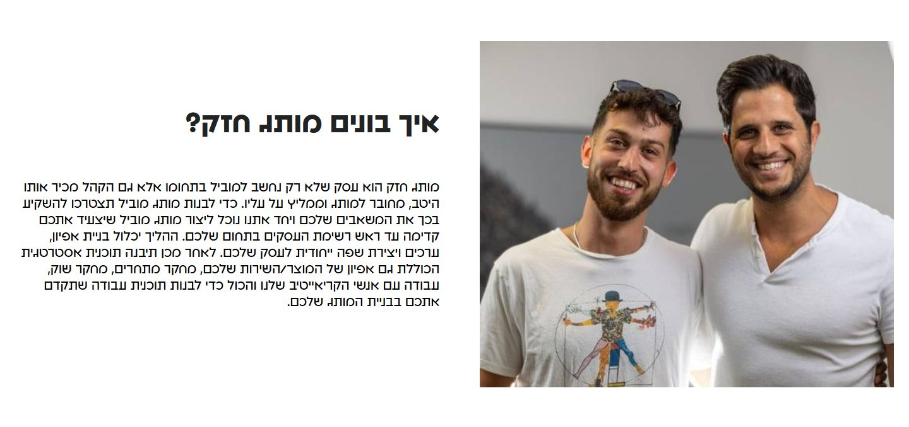 |
| 9 | content | 678 / 883 | `#ffffff` | 0 / 0 | 2 (47.8/48.3%) | start | H2 45px 700 “לערב את הקהל בדרך שלכם” | 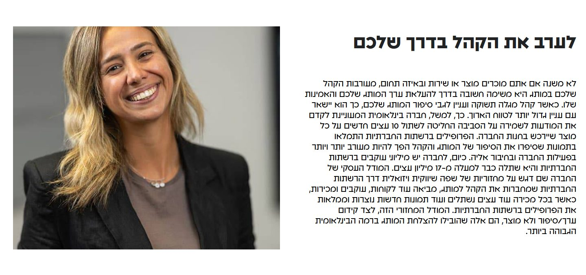 |
| 10 | content | 678 / 807 | `#ffffff` | 0 / 0 | 2 (48.3/47.8%) | start | H2 45px 700 “כיצד אנו בג'נסיס יכולים לעזור לכם?” | 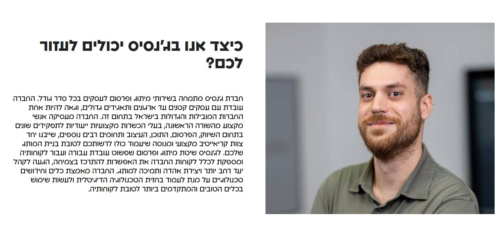 |
| 11 | content | 678 / 675 | `#ffffff` | 0 / 0 | 2 (47.8/48.3%) | start | H2 45px 700 “מהו הליך מיתוג מחדש לעסק?” | 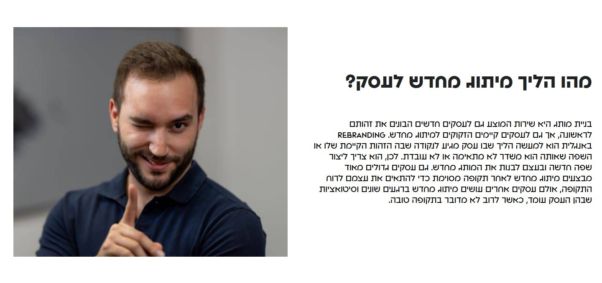 |
| 12 | content | 808 / 959 | `#ffffff` | 0 / 0 | 2 (48.3/47.8%) | start | H2 45px 700 “סימנים המעידים על כך שהעסק שלכם זקוק למיתוג מחדש:” | 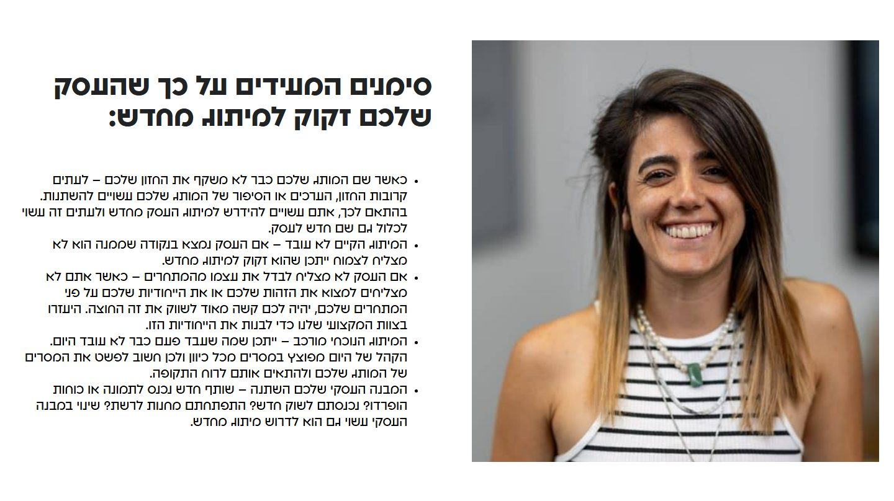 |
| 13 | faq/accordion | 540 / 688 | `#ffffff` | 0 / 0 | 2 (60.8/30.9%) | start | H2 50px 700 “שאלות-תשובות מיתוג עסקי” | 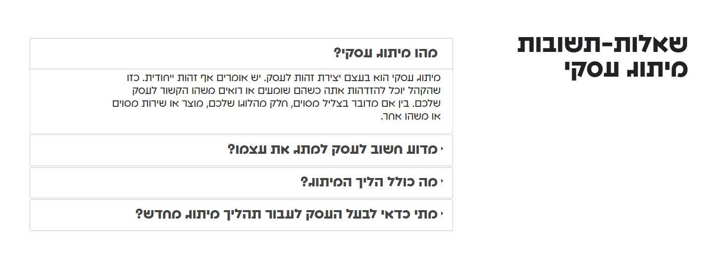 |
| 14 | form | 466 / 713 | `#e9e9e9` | 10 / 10 | 1 | start | H3 30px 700 “ליצירת קשר עם יועץ מקצועי השאירו פרטים וניצור איתכם קשר בהקד” | 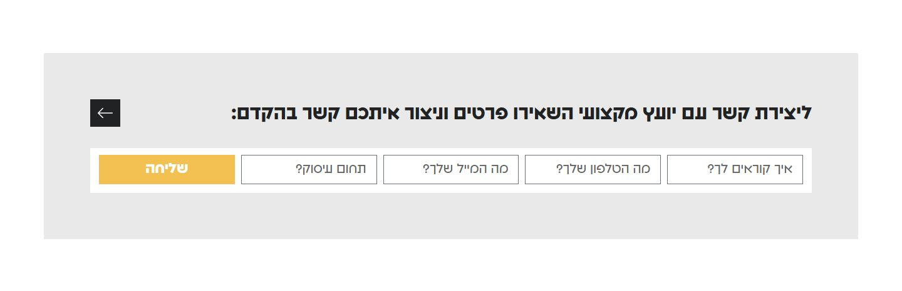 |
| 15 | footer | 400 / — | `#212224` | 0 / 0 | 4 (27.9/21.7/21.7/21.7%) | start |  | 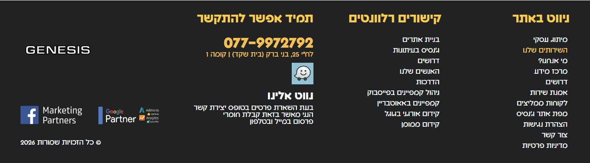 |

Text outline: [pages/03-שירות-מיתוג-עסקי.md](pages/03-שירות-מיתוג-עסקי.md)

### 04-קידום-אתרים — קידום אתרים אורגני - קבלו את השיטה שתביא לכם פי 5 תוצאות | ג'נסיס פרסום

https://www.gnss.co.il/%d7%a7%d7%99%d7%93%d7%95%d7%9d-%d7%90%d7%aa%d7%a8%d7%99%d7%9d/ · page height desktop 9755px · tablet 15725px · mobile 10446px

| # | kind | height (desk / mob) | background | padding-y | columns | align | heading | shot |
| --- | --- | --- | --- | --- | --- | --- | --- | --- |
| 1 | hero | 931 / 651 | `#ffffff` | 0 / 0 | 2 (48.6/48.1%) | start | H1 54px 700 “קידום אתרים בגוגל? הצטרפו להצלחה!” | 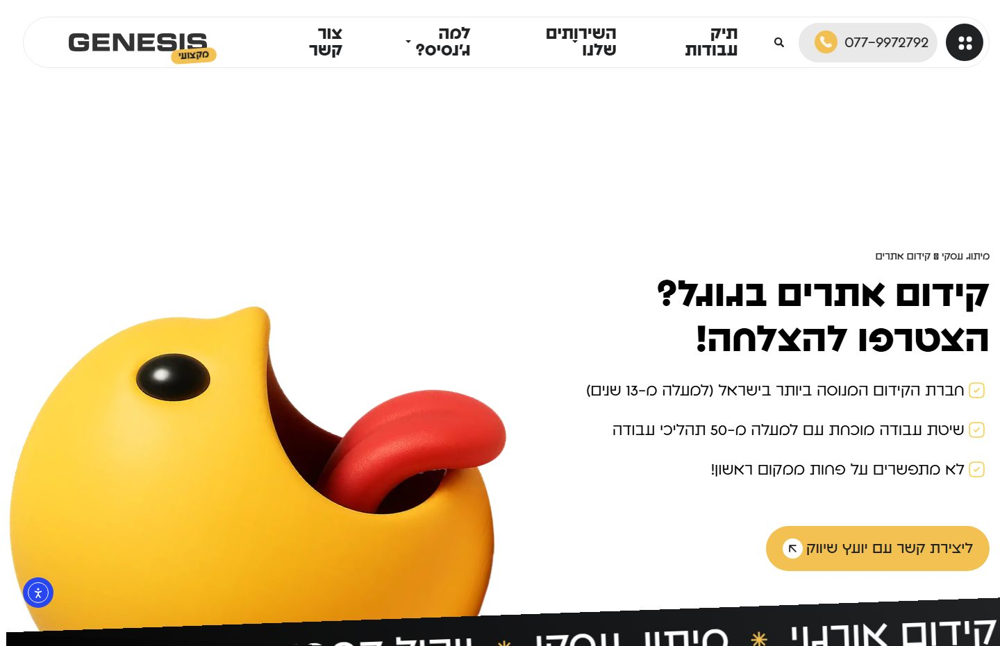 |
| 2 | content | 157 / — | `linear-gradient(249deg, #212224 0%, #000000 100%)` | 10 / 10 | 2 (16.5/17.6%) | — |  |  |
| 3 | content | 132 / — | `linear-gradient(249deg, #212224 0%, #000000 100%)` | 10 / 10 | 1 | — |  |  |
| 4 | testimonials | 1722 / 1516 | `#ffffff` | 0 / 0 | 1 | start | H2 103px 300 “לקוחות ממליצים” |  |
| 5 | content | 652 / 677 | `#ffffff` | 0 / 0 | 1 | start | H2 45px 700 “קידום אתרים? קבלו 7 טיפים שיהפכו את האתר שלכם למכונת לידים מ” | 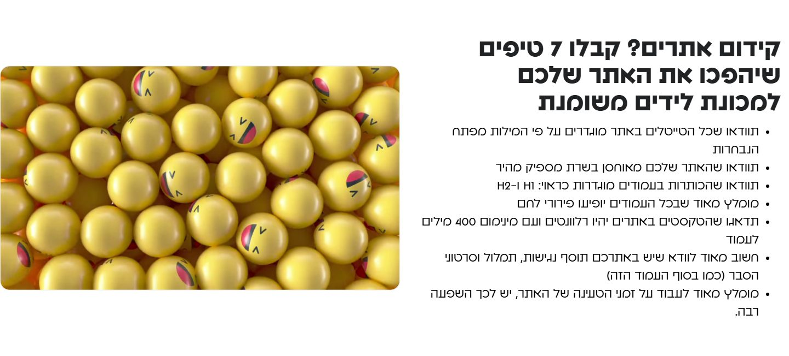 |
| 6 | content | 503 / 655 | `#ffffff` | 0 / 0 | 2 (46.1/46.1%) | start | H2 45px 700 “7 סיבות למה GENESIS מובילה את תחום "קידום אתרים" בישראל-” | 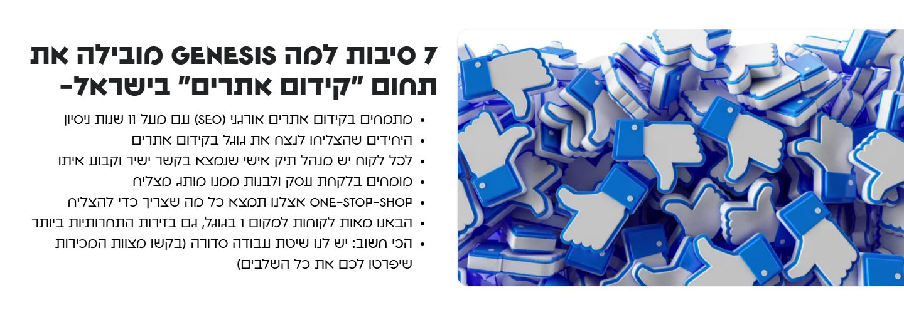 |
| 7 | content | 562 / 507 | `#ffffff` | 0 / 0 | 2 (46.1/46.1%) | start | H2 45px 700 “קידום אתרים אורגני. איפה אנחנו שמים את הדגש?” | 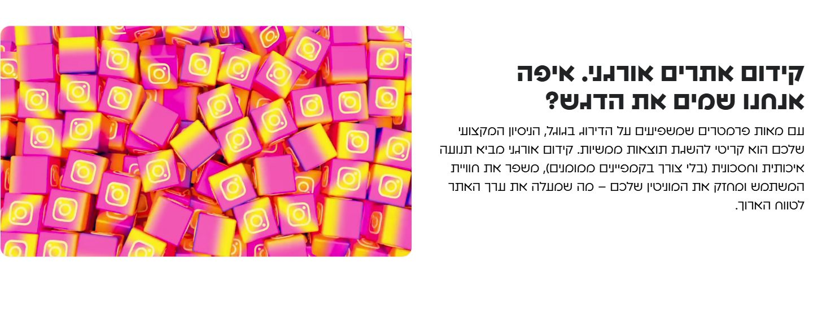 |
| 8 | content | 253 / 563 | `#212224` | 0 / 0 | 1 | start | H2 45px 700 “בכל פעם שהיד של ג'נסיס נוגעת בעסק שלך – הפוטנציאל צומח, והחש” |  |
| 9 | content | 431 / — | `#212224` | 0 / 0 | 1 | — |  |  |
| 10 | content | 691 / 679 | `#ffffff` | 0 / 0 | 1 | start | H2 45px 700 “קידום אתרים באופן עצמאי או עם חברת פרסום?” | 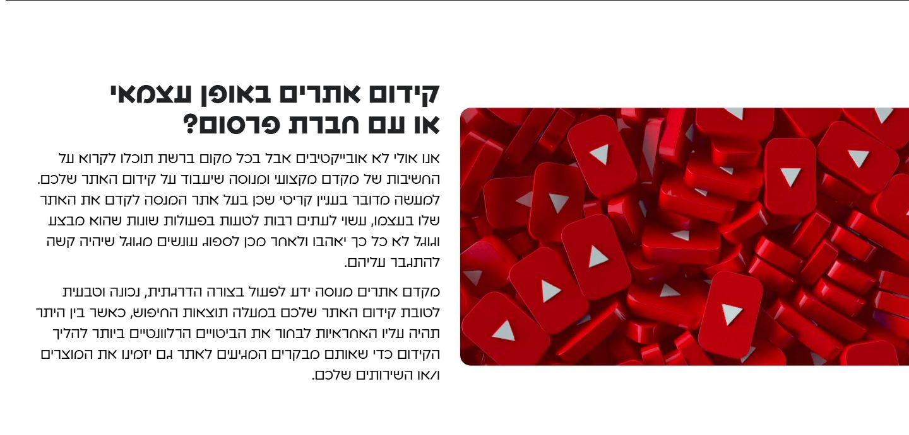 |
| 11 | content | 567 / 624 | `#ffffff` | 0 / 0 | 1 | start | H2 45px 700 “קידום אתרים אורגני עם חברת הפרסום ג'נסיס – חברה שמדברת תוצאו” | 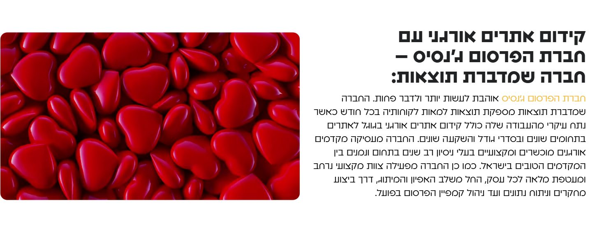 |
| 12 | content | 794 / 807 | `#ffffff` | 0 / 0 | 1 | start | H2 45px 700 “מדוע לעבוד עם חברת ג'נסיס על קידום האתר שלכם?” | 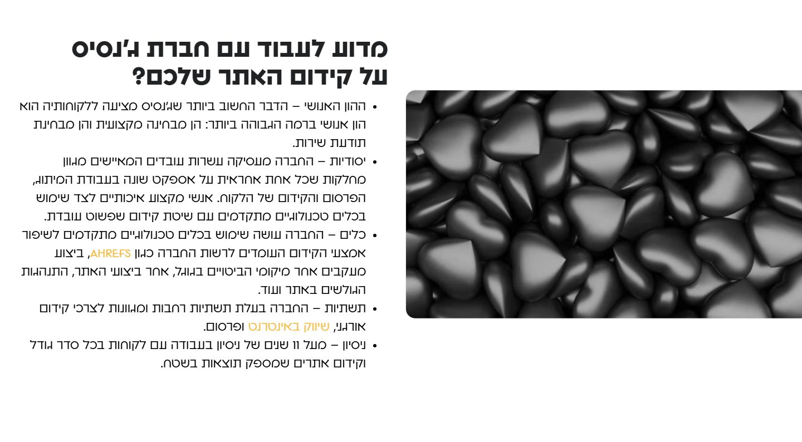 |
| 13 | form | 900 / 844 | `#ffffff` | 10 / 10 | 1 | center | H2 79px 700 “מוכנים לקשר רציני?” |  |
| 14 | content | 1200 / 1094 | `#ffffff` | 0 / 0 | 1 | start | H2 45px 700 “שאלות ותשובות” | 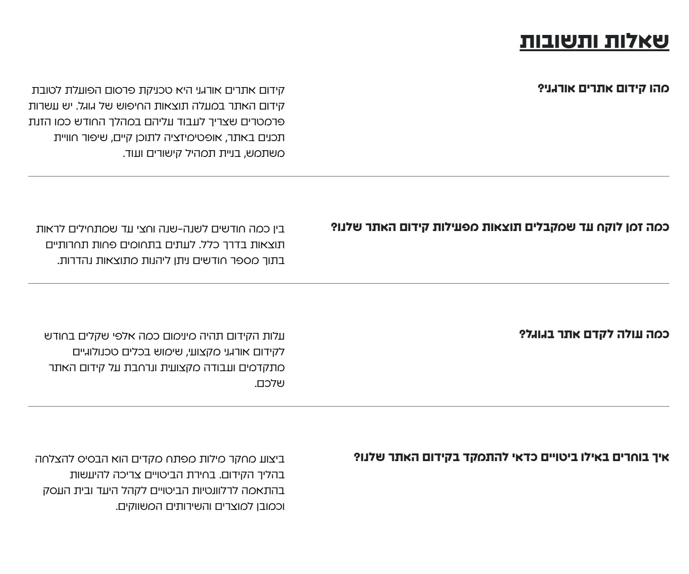 |
| 15 | footer | 400 / — | `#212224` | 0 / 0 | 4 (27.9/21.7/21.7/21.7%) | start |  |  |

Text outline: [pages/04-קידום-אתרים.md](pages/04-קידום-אתרים.md)

### 05-ניהול-סושיאל — ניהול רשתות חברתיות עם עיצובים 100% היסטרים | ג'נסיס מיתוג ופרסום

https://www.gnss.co.il/%d7%a0%d7%99%d7%94%d7%95%d7%9c-%d7%a1%d7%95%d7%a9%d7%99%d7%90%d7%9c/ · page height desktop 10386px · tablet 15882px · mobile 10831px

| # | kind | height (desk / mob) | background | padding-y | columns | align | heading | shot |
| --- | --- | --- | --- | --- | --- | --- | --- | --- |
| 1 | hero | 931 / 635 | `#ffffff` | 0 / 0 | 2 (48.6/48.1%) | start | H1 54px 700 “ניהול רשתות חברתיות!” | 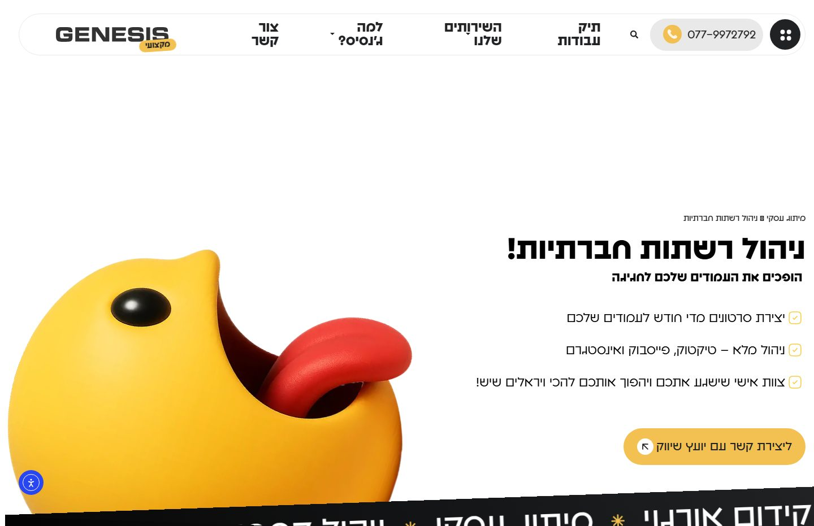 |
| 2 | content | 157 / — | `linear-gradient(249deg, #212224 0%, #000000 100%)` | 10 / 10 | 2 (16.5/17.6%) | — |  |  |
| 3 | content | 132 / — | `linear-gradient(249deg, #212224 0%, #000000 100%)` | 10 / 10 | 1 | — |  |  |
| 4 | testimonials | 1722 / 1516 | `#ffffff` | 0 / 0 | 1 | start | H2 103px 300 “לקוחות ממליצים” |  |
| 5 | content | 502 / 537 | `#ffffff` | 0 / 0 | 2 (46.1/46.1%) | start | H2 45px 700 “7 סיבות למה כדאי להשקיע ברשתות חברתיות לעסק שלך?” | 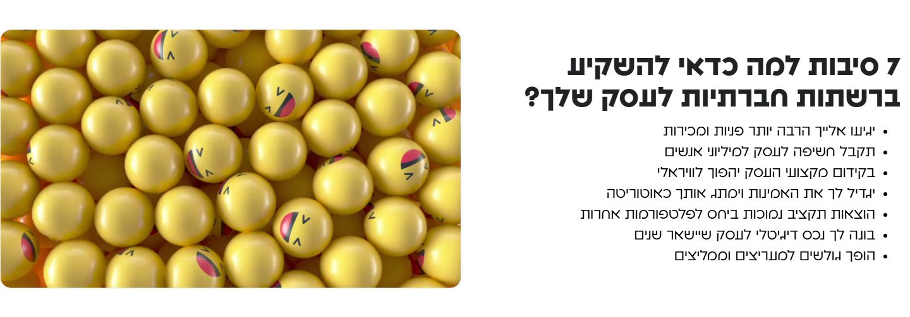 |
| 6 | content | 502 / 560 | `#ffffff` | 0 / 0 | 2 (46.1/46.1%) | start | H2 45px 700 “7 סיבות למה GENESIS היא החברה הטובה ביותר עבורך” | 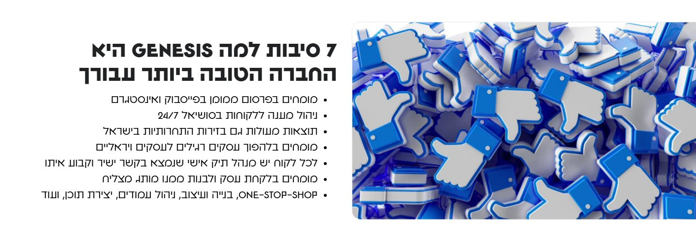 |
| 7 | content | 804 / 783 | `#ffffff` | 0 / 0 | 1 | start | H2 45px 700 “ניהול רשתות חברתיות - מה זה אומר?” | 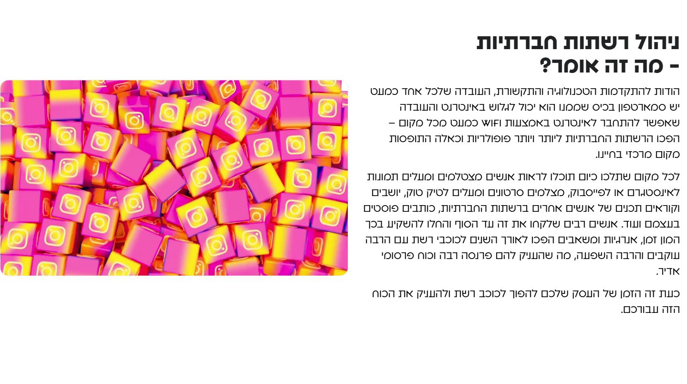 |
| 8 | content | 253 / 563 | `#212224` | 0 / 0 | 1 | start | H2 45px 700 “בכל פעם שהיד של ג'נסיס נוגעת בעסק שלך – הפוטנציאל צומח, והחש” | 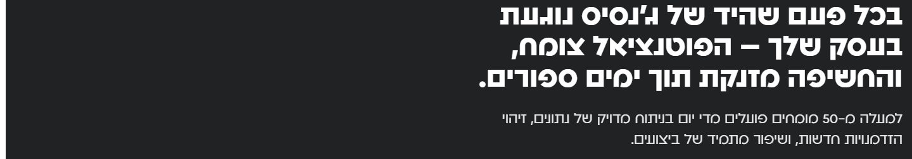 |
| 9 | content | 431 / — | `#212224` | 0 / 0 | 1 | — |  |  |
| 10 | content | 691 / 701 | `#ffffff` | 0 / 0 | 1 | start | H2 45px 700 “לחיות ב-LIVE את הרשת ולייצר תוצאות מיידיות” | 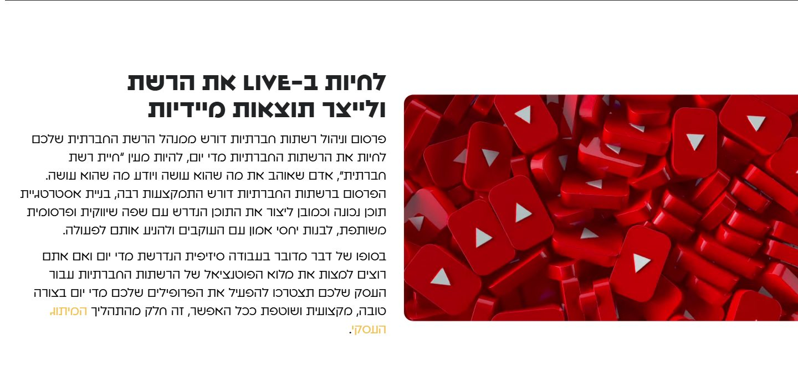 |
| 11 | content | 598 / 679 | `#ffffff` | 0 / 0 | 1 | start | H2 45px 700 “ניהול אינסטגרם עסקי עם חשיפה מירבית.” | 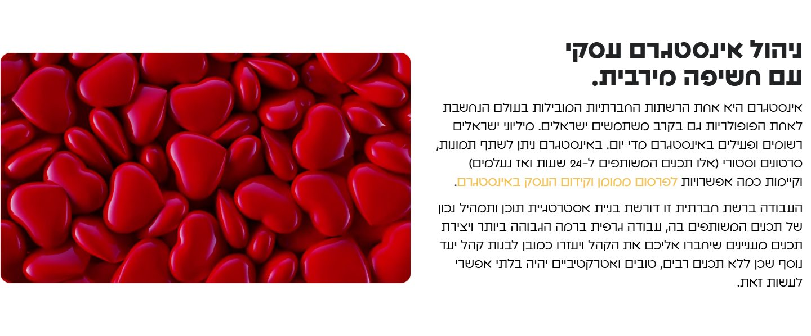 |
| 12 | content | 740 / 706 | `#ffffff` | 0 / 0 | 1 | start | H2 45px 700 “שיווק דיגיטלי חכם לעסק שלכם – פייסבוק, יוטיוב וכתבות ממומנות” | 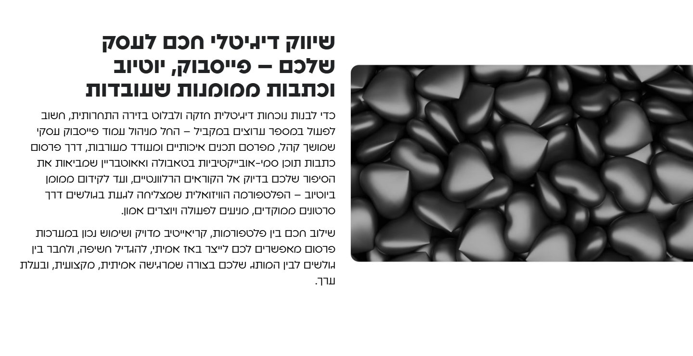 |
| 13 | form | 900 / 844 | `#ffffff` | 10 / 10 | 1 | center | H2 79px 700 “מוכנים לקשר רציני?” |  |
| 14 | content | 1761 / 1477 | `#ffffff` | 0 / 0 | 1 | start | H2 45px 700 “שאלות ותשובות” | 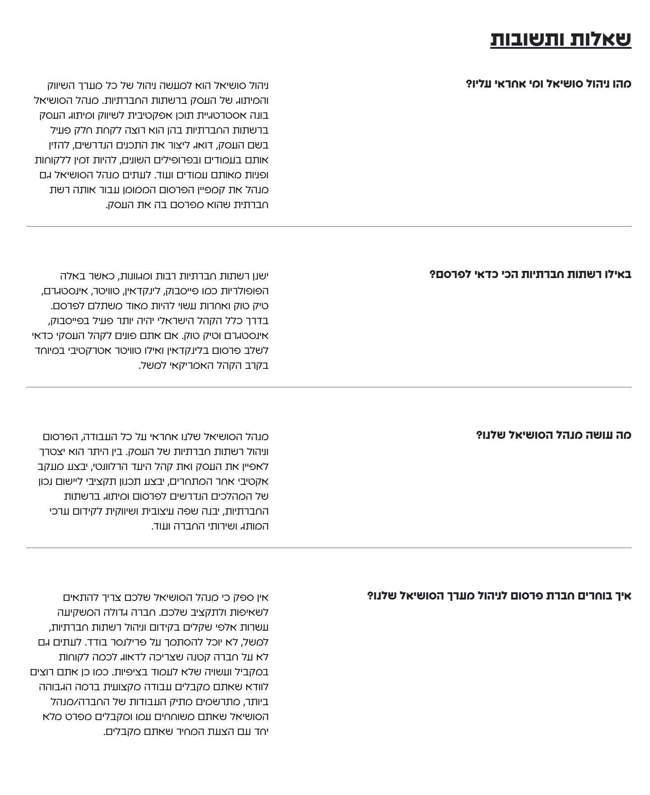 |
| 15 | footer | 400 / — | `#212224` | 0 / 0 | 4 (27.9/21.7/21.7/21.7%) | start |  | 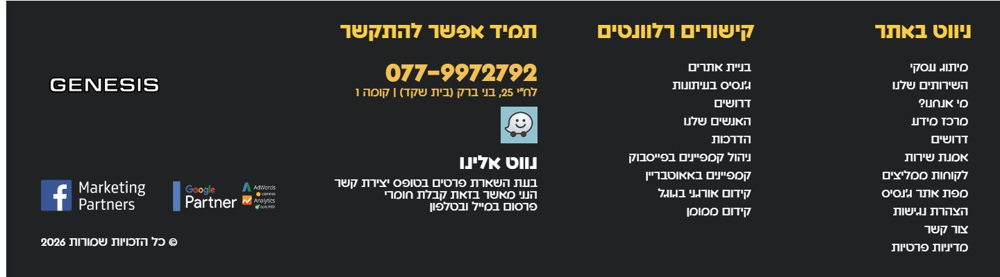 |

Text outline: [pages/05-ניהול-סושיאל.md](pages/05-ניהול-סושיאל.md)

### 06-פרסומות-דיגיטליות — סרטוני סושיאל לעסקים עם קריאייטיב היסטרי | ג'נסיס מיתוג ופרסום

https://www.gnss.co.il/%d7%a4%d7%a8%d7%a1%d7%95%d7%9e%d7%95%d7%aa-%d7%93%d7%99%d7%92%d7%99%d7%98%d7%9c%d7%99%d7%95%d7%aa/ · page height desktop 10178px · tablet 15991px · mobile 10811px

| # | kind | height (desk / mob) | background | padding-y | columns | align | heading | shot |
| --- | --- | --- | --- | --- | --- | --- | --- | --- |
| 1 | hero | 931 / 537 | `#ffffff` | 0 / 0 | 2 (48.6/48.1%) | start | H1 54px 700 “סרטוני סושיאל לעסקים עם טאץ' יוצא דופן” | 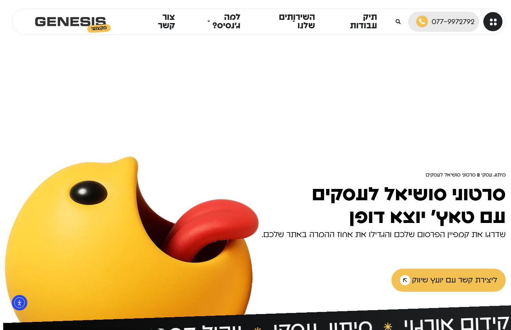 |
| 2 | content | 157 / — | `linear-gradient(249deg, #212224 0%, #000000 100%)` | 10 / 10 | 2 (16.5/17.6%) | — |  |  |
| 3 | content | 132 / — | `linear-gradient(249deg, #212224 0%, #000000 100%)` | 10 / 10 | 1 | — |  |  |
| 4 | testimonials | 1722 / 1516 | `#ffffff` | 0 / 0 | 1 | start | H2 103px 300 “לקוחות ממליצים” |  |
| 5 | content | 680 / 791 | `#ffffff` | 0 / 0 | 1 | start | H2 45px 700 “שיווק באמצעות תמונות וסרטונים.” | 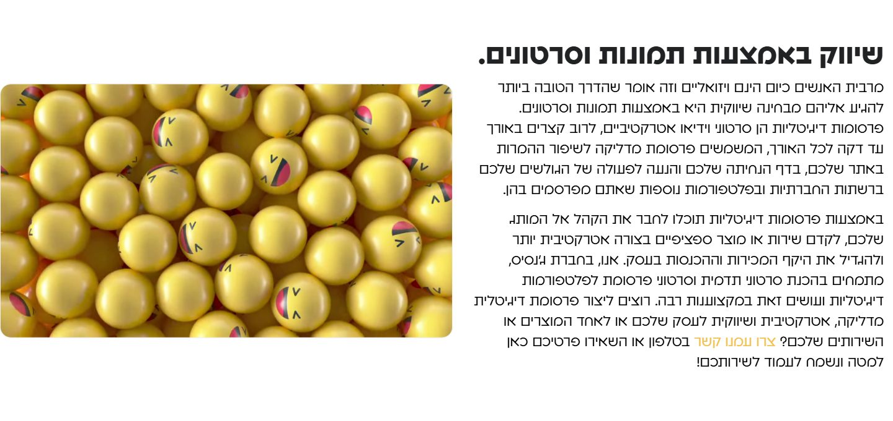 |
| 6 | content | 502 / 574 | `#ffffff` | 0 / 0 | 2 (46.1/46.1%) | start | H2 45px 700 “היתרונות של פרסומת דיגיטלית לעסק שלכם:” | 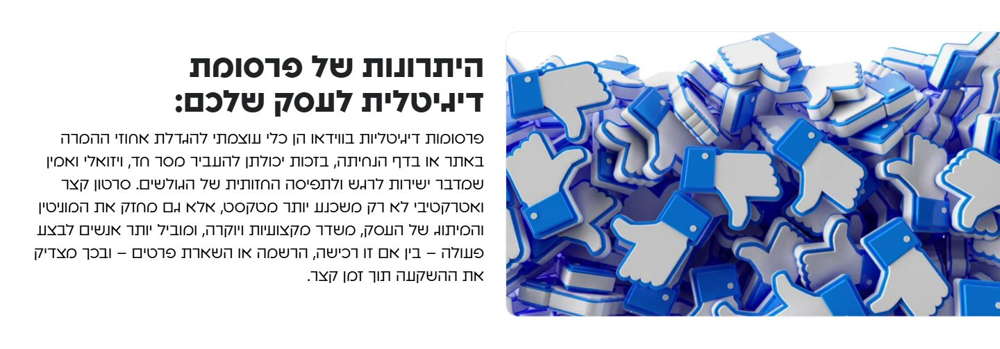 |
| 7 | content | 893 / 897 | `#ffffff` | 0 / 0 | 1 | start | H2 45px 700 “דגשים חשובים לבניית פרסומת דיגיטלית מוצלחת:” | 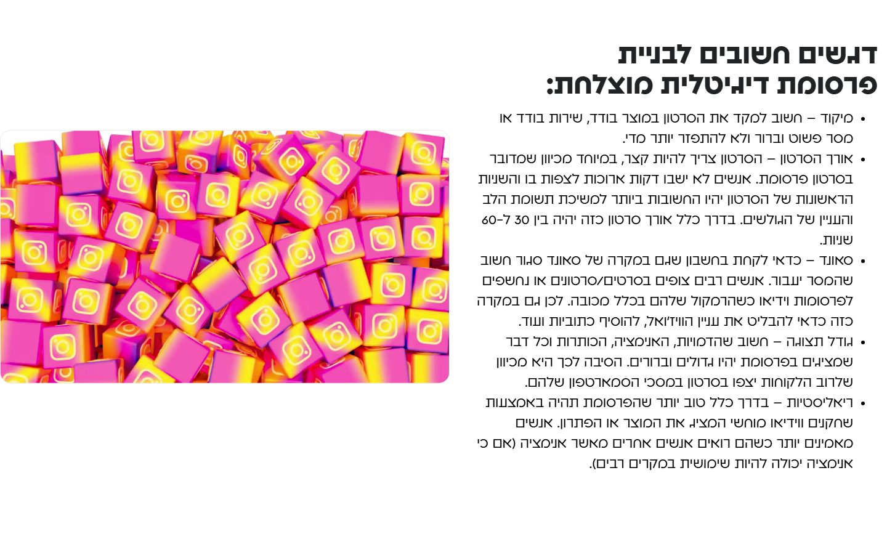 |
| 8 | content | 253 / 563 | `#212224` | 0 / 0 | 1 | start | H2 45px 700 “בכל פעם שהיד של ג'נסיס נוגעת בעסק שלך – הפוטנציאל צומח, והחש” |  |
| 9 | content | 431 / — | `#212224` | 0 / 0 | 1 | — |  |  |
| 10 | content | 577 / 619 | `#ffffff` | 0 / 0 | 2 (46.1/46.1%) | start | H2 45px 700 “הליך בנייה והפקת סרטון מקצועיים עם ג'נסיס:” | 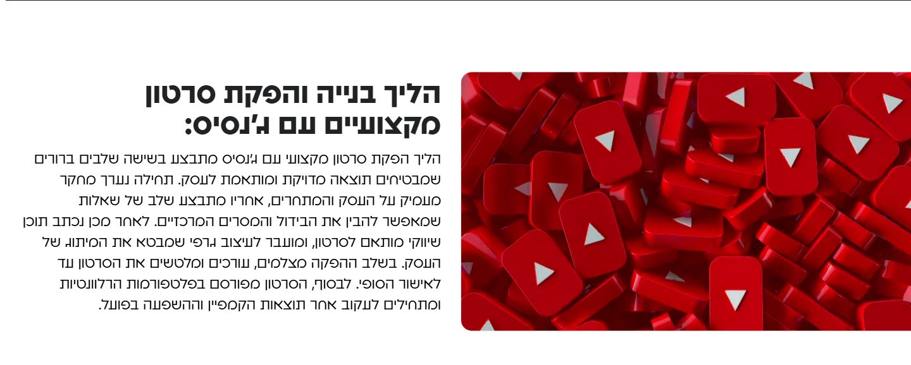 |
| 11 | content | 730 / 769 | `#ffffff` | 0 / 0 | 1 | start | H2 45px 700 “האם פרסומות דיגיטליות יכולות להתאים לעסק שלכם?” | 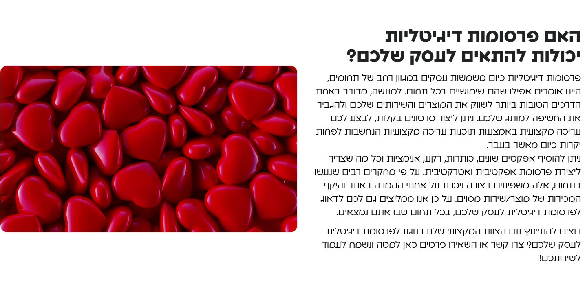 |
| 12 | content | 610 / 619 | `#ffffff` | 0 / 0 | 1 | start | H2 45px 700 “יתרונות וייחודיות של העסק שלכם והמוצר שלכם” | 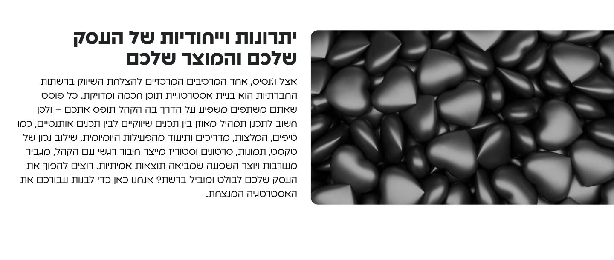 |
| 13 | form | 900 / 844 | `#ffffff` | 10 / 10 | 1 | center | H2 79px 700 “מוכנים לקשר רציני?” |  |
| 14 | content | 1398 / 1252 | `#ffffff` | 0 / 0 | 1 | start | H2 45px 700 “שאלות ותשובות” | 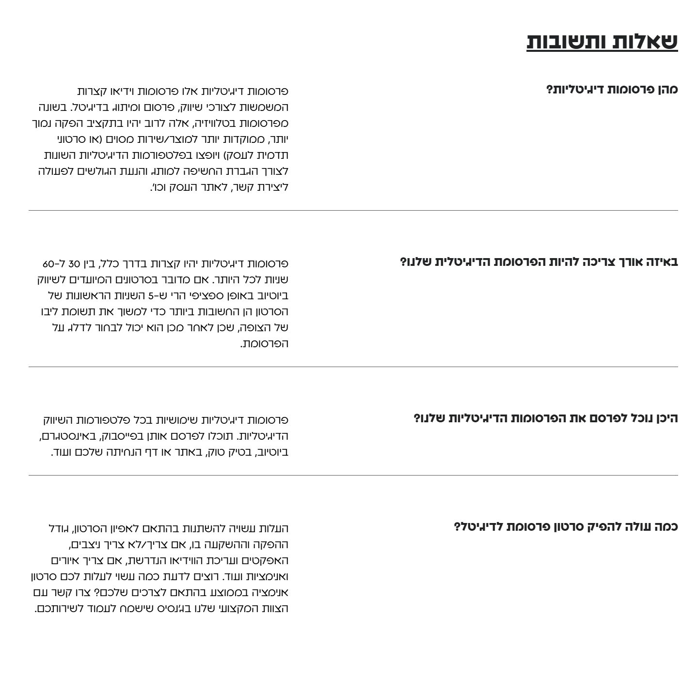 |
| 15 | footer | 400 / — | `#212224` | 0 / 0 | 4 (27.9/21.7/21.7/21.7%) | start |  | 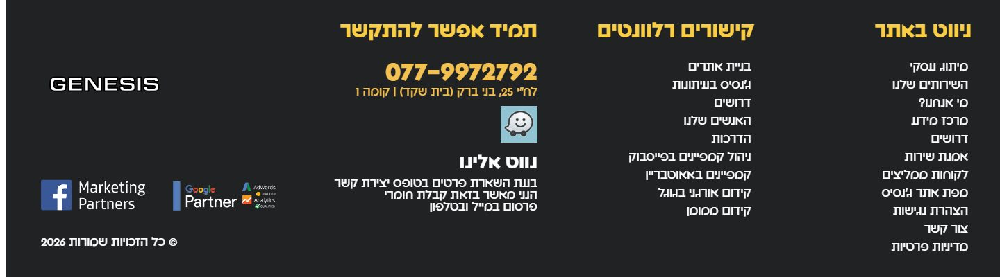 |

Text outline: [pages/06-פרסומות-דיגיטליות.md](pages/06-פרסומות-דיגיטליות.md)

### 07-פרסום-וקידום-תוכן-ברשת — קמפיינים באאוטברייין - תוכן הוא המלך! | ג'נסיס מיתוג ופרסום

https://www.gnss.co.il/%d7%a4%d7%a8%d7%a1%d7%95%d7%9d-%d7%95%d7%a7%d7%99%d7%93%d7%95%d7%9d-%d7%aa%d7%95%d7%9b%d7%9f-%d7%91%d7%a8%d7%a9%d7%aa/ · page height desktop 9548px · tablet 14936px · mobile 10031px

| # | kind | height (desk / mob) | background | padding-y | columns | align | heading | shot |
| --- | --- | --- | --- | --- | --- | --- | --- | --- |
| 1 | hero | 931 / 537 | `#ffffff` | 0 / 0 | 2 (48.6/48.1%) | start | H1 54px 700 “קמפיינים באאוטבריין - לייצר לידים באמצעות תוכן חכם” | 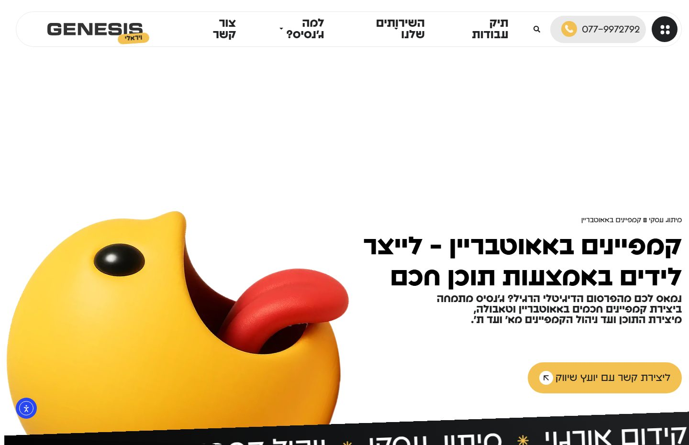 |
| 2 | content | 157 / — | `linear-gradient(249deg, #212224 0%, #000000 100%)` | 10 / 10 | 2 (16.5/17.6%) | — |  |  |
| 3 | content | 132 / — | `linear-gradient(249deg, #212224 0%, #000000 100%)` | 10 / 10 | 1 | — |  | 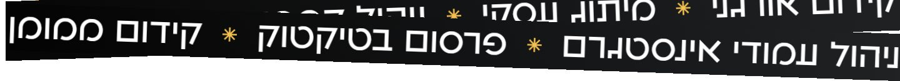 |
| 4 | testimonials | 1722 / 1516 | `#ffffff` | 0 / 0 | 1 | start | H2 103px 300 “לקוחות ממליצים” |  |
| 5 | content | 532 / 611 | `#ffffff` | 0 / 0 | 1 | start | H2 45px 700 “יצירת לקוחות באמצעות פרסום וקידום תוכן ברשת” | 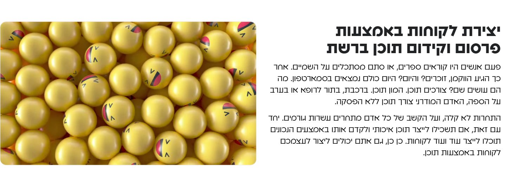 |
| 6 | content | 612 / 670 | `#ffffff` | 0 / 0 | 1 | start | H2 45px 700 “יצירת תוכן או קידום ממומן? זה לא בהכרח סותר” | 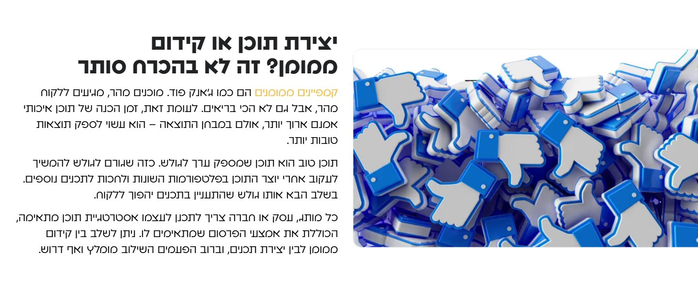 |
| 7 | content | 562 / 457 | `#ffffff` | 0 / 0 | 2 (46.1/46.1%) | start | H2 45px 700 “פרסום בכל צבעי התוכן” | 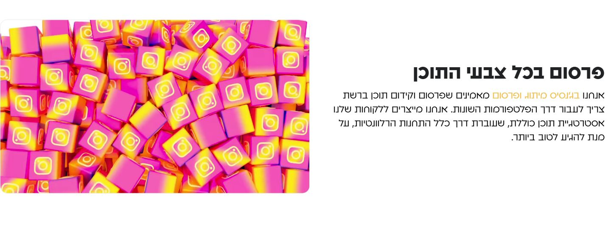 |
| 8 | content | 253 / 563 | `#212224` | 0 / 0 | 1 | start | H2 45px 700 “בכל פעם שהיד של ג'נסיס נוגעת בעסק שלך – הפוטנציאל צומח, והחש” | 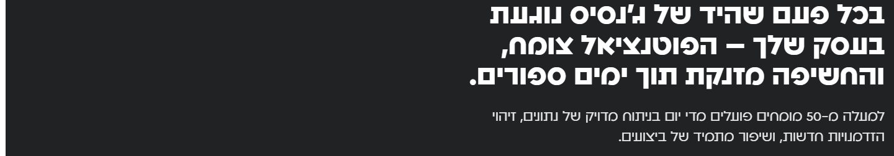 |
| 9 | content | 431 / — | `#212224` | 0 / 0 | 1 | — |  | 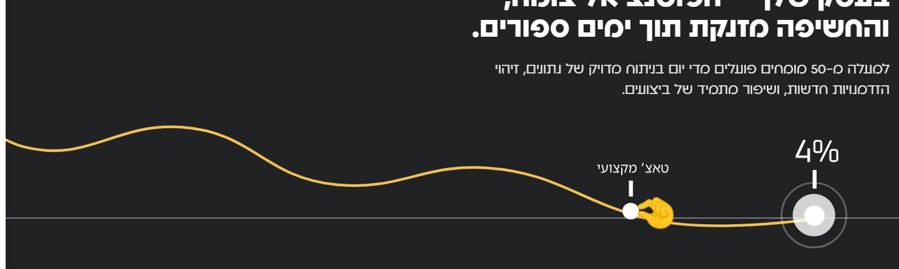 |
| 10 | content | 691 / 724 | `#ffffff` | 0 / 0 | 1 | start | H2 45px 700 “טאבולה ואאוטבריין: התוכן שלכם יופיע בכל מקום” | 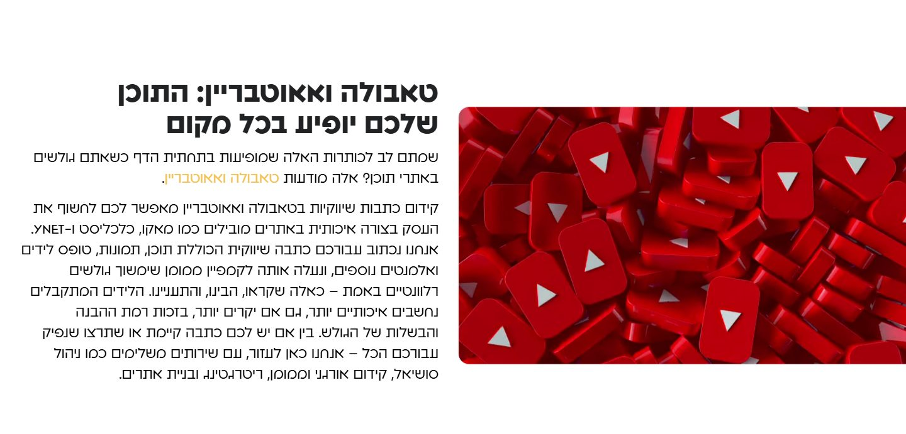 |
| 11 | content | 502 / 544 | `#ffffff` | 0 / 0 | 2 (46.1/46.1%) | start | H2 45px 700 “הגיע הזמן שגם אתה תהיה יוטיובר” | 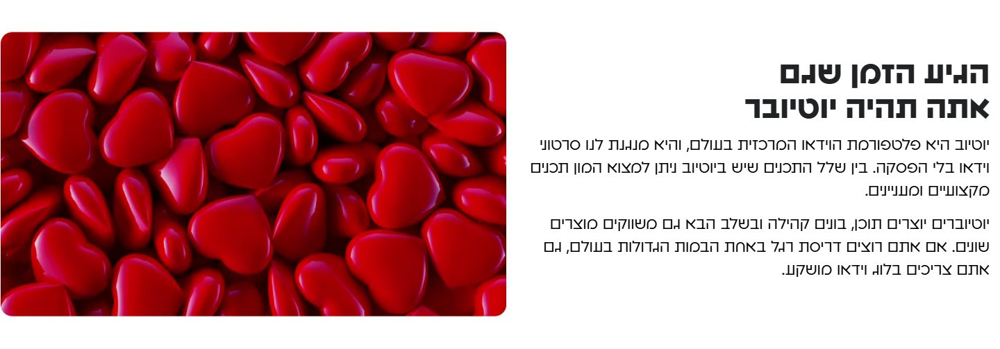 |
| 12 | content | 562 / 552 | `#ffffff` | 0 / 0 | 2 (46.1/46.1%) | start | H2 45px 700 “הכוח שבסבלנות ותוכן: להפוך את העסק שלכם למגנט דיגיטלי” | 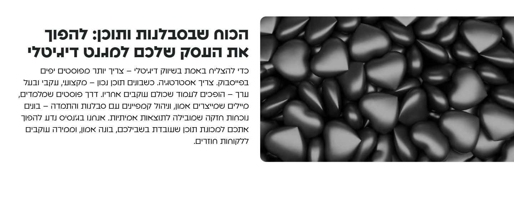 |
| 13 | form | 900 / 844 | `#ffffff` | 10 / 10 | 1 | center | H2 79px 700 “מוכנים לקשר רציני?” |  |
| 14 | content | 1299 / 1184 | `#ffffff` | 0 / 0 | 1 | start | H2 45px 700 “שאלות ותשובות” | 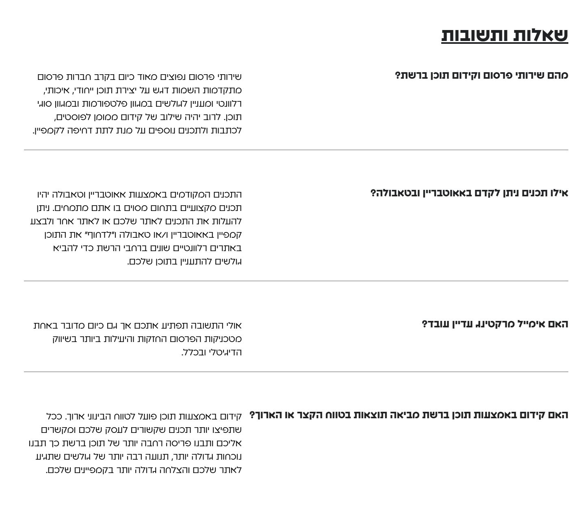 |
| 15 | footer | 400 / — | `#212224` | 0 / 0 | 4 (27.9/21.7/21.7/21.7%) | start |  | 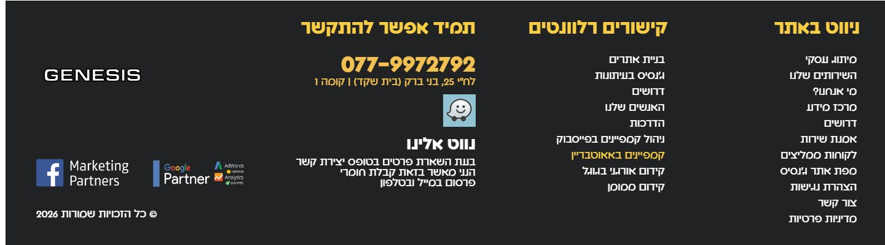 |

Text outline: [pages/07-פרסום-וקידום-תוכן-ברשת.md](pages/07-פרסום-וקידום-תוכן-ברשת.md)

### 08-ניהול-רשת-חברתית-עם-גנסיס — פרסום בפייסבוק - השיטה שתביא לכם פי 5 חשיפה | ג'נסיס פרסום עסקים

https://www.gnss.co.il/%d7%a0%d7%99%d7%94%d7%95%d7%9c-%d7%a8%d7%a9%d7%aa-%d7%97%d7%91%d7%a8%d7%aa%d7%99%d7%aa-%d7%a2%d7%9d-%d7%92%d7%a0%d7%a1%d7%99%d7%a1/ · page height desktop 10055px · tablet 15637px · mobile 10573px

| # | kind | height (desk / mob) | background | padding-y | columns | align | heading | shot |
| --- | --- | --- | --- | --- | --- | --- | --- | --- |
| 1 | hero | 931 / 651 | `#ffffff` | 0 / 0 | 2 (48.6/48.1%) | start | H1 54px 700 “פרסום ממומן בפייסבוק? הצטרפו להצלחה!” | 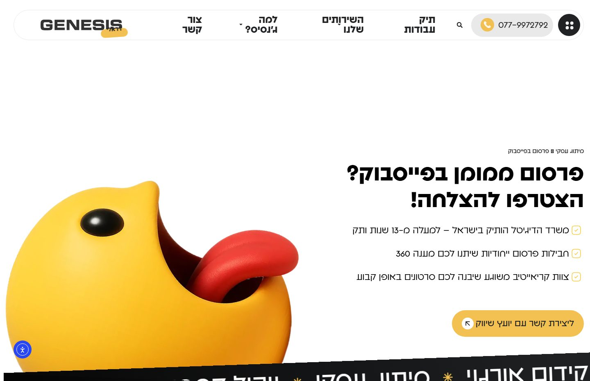 |
| 2 | content | 157 / — | `linear-gradient(249deg, #212224 0%, #000000 100%)` | 10 / 10 | 2 (16.5/17.6%) | — |  |  |
| 3 | content | 132 / — | `linear-gradient(249deg, #212224 0%, #000000 100%)` | 10 / 10 | 1 | — |  |  |
| 4 | testimonials | 1722 / 1516 | `#ffffff` | 0 / 0 | 1 | start | H2 103px 300 “לקוחות ממליצים” |  |
| 5 | content | 502 / 537 | `#ffffff` | 0 / 0 | 2 (46.1/46.1%) | start | H2 45px 700 “7 סיבות למה העסק שלך חייב קידום ממומן בפייסבוק?” | 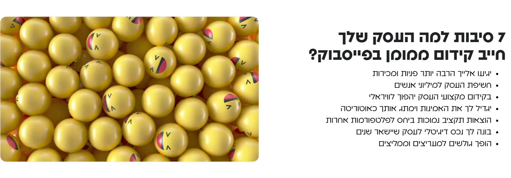 |
| 6 | content | 502 / 560 | `#ffffff` | 0 / 0 | 2 (46.1/46.1%) | start | H2 45px 700 “7 סיבות למה Genesis היא החברה הטובה ביותר עבורך” | 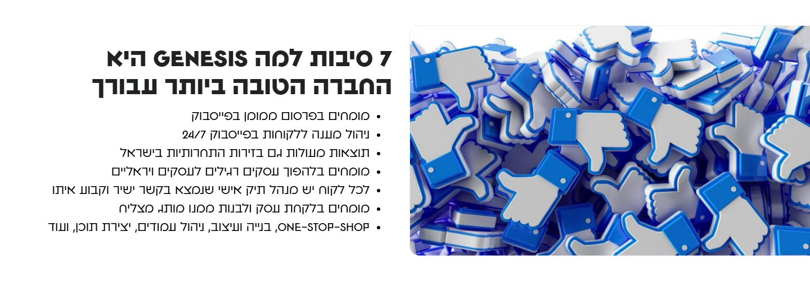 |
| 7 | content | 786 / 752 | `#ffffff` | 0 / 0 | 1 | start | H2 45px 700 “אז למה לעשות פרסום בפייסבוק ובאינסטגרם?” | 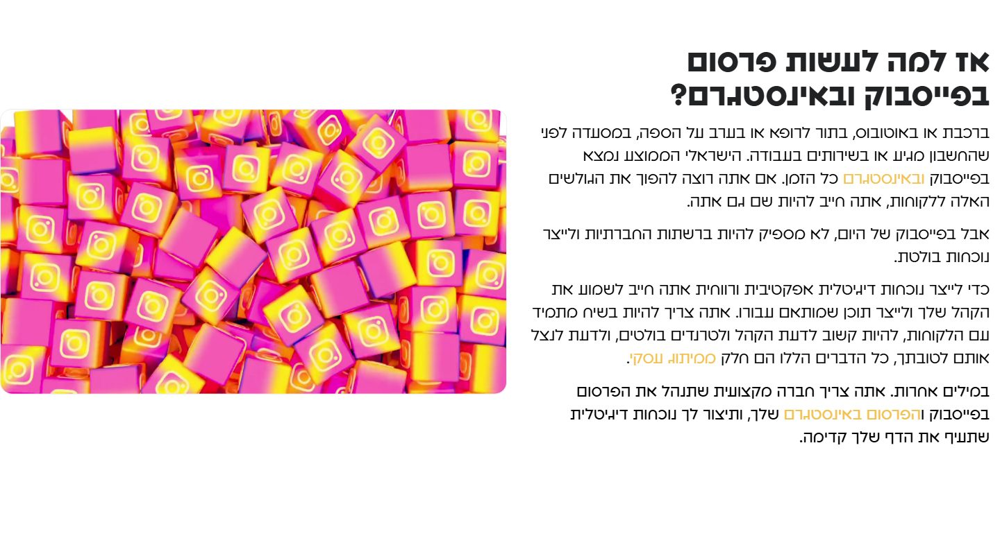 |
| 8 | content | 253 / 563 | `#212224` | 0 / 0 | 1 | start | H2 45px 700 “בכל פעם שהיד של ג'נסיס נוגעת בעסק שלך – הפוטנציאל צומח, והחש” |  |
| 9 | content | 431 / — | `#212224` | 0 / 0 | 1 | — |  |  |
| 10 | content | 734 / 744 | `#ffffff` | 0 / 0 | 1 | start | H2 45px 700 “פתיחת עמוד עסקי בפייסבוק שמביא תוצאות” | 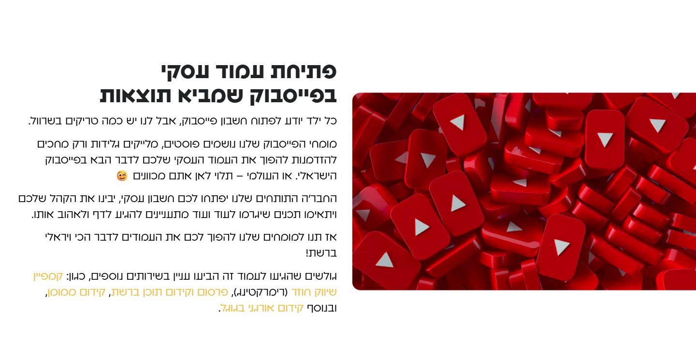 |
| 11 | content | 693 / 730 | `#ffffff` | 0 / 0 | 1 | start | H2 45px 700 “בניית קהילה חזקה עם DATA מדויקת במיוחד” | 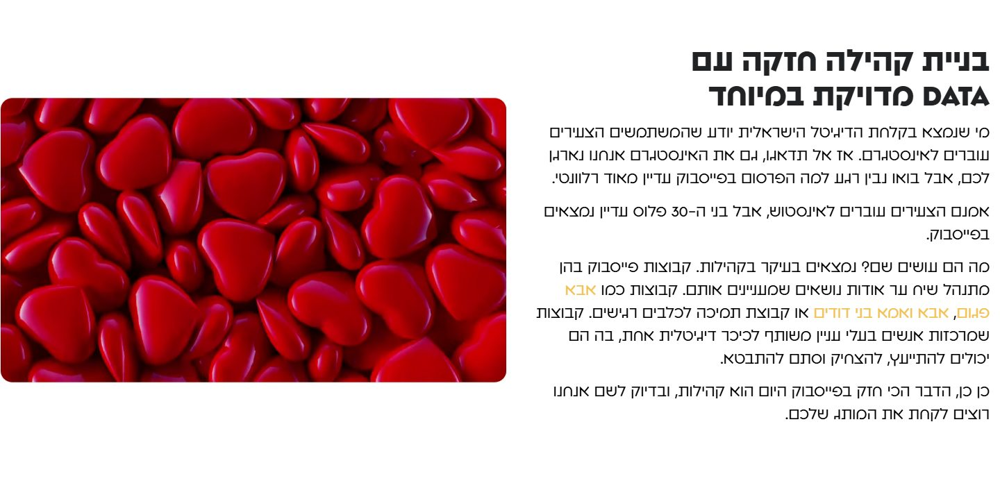 |
| 12 | content | 654 / 640 | `#ffffff` | 0 / 0 | 1 | start | H2 45px 700 “פילוח וטירגוט קהל היעד הנכון לעסק שלכם” | 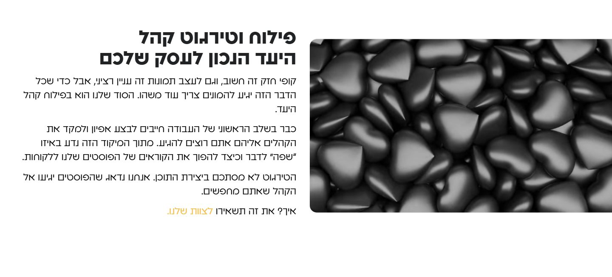 |
| 13 | form | 900 / 844 | `#ffffff` | 10 / 10 | 1 | center | H2 79px 700 “מוכנים לקשר רציני?” |  |
| 14 | content | 1398 / 1206 | `#ffffff` | 0 / 0 | 1 | start | H2 45px 700 “שאלות ותשובות” | 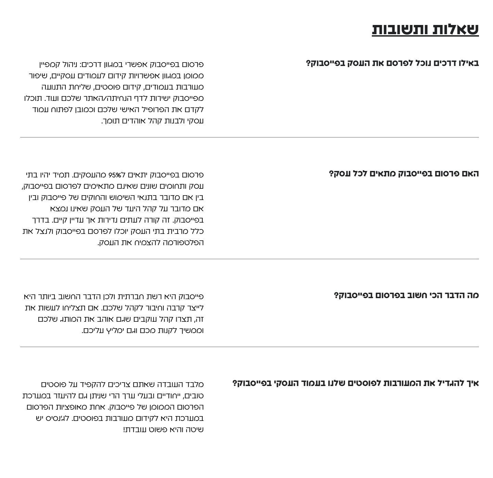 |
| 15 | footer | 400 / — | `#212224` | 0 / 0 | 4 (27.9/21.7/21.7/21.7%) | start |  | 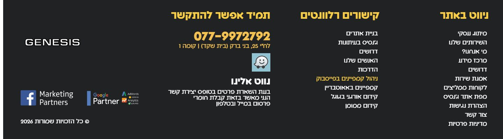 |

Text outline: [pages/08-ניהול-רשת-חברתית-עם-גנסיס.md](pages/08-ניהול-רשת-חברתית-עם-גנסיס.md)

### 09-פרסום-באינסטגרם — פרסום באינסטגרם - איך להביא מלא לקוחות | השיטה שאתם חייבים להכיר | ג'נסיס

https://www.gnss.co.il/%d7%a4%d7%a8%d7%a1%d7%95%d7%9d-%d7%91%d7%90%d7%99%d7%a0%d7%a1%d7%98%d7%92%d7%a8%d7%9d/ · page height desktop 9985px · tablet 15407px · mobile 10388px

| # | kind | height (desk / mob) | background | padding-y | columns | align | heading | shot |
| --- | --- | --- | --- | --- | --- | --- | --- | --- |
| 1 | hero | 931 / 605 | `#ffffff` | 0 / 0 | 2 (48.6/48.1%) | start | H1 54px 700 “פרסום באינסטגרם? יש לנו הצעה מיוחדת עבורכם” | 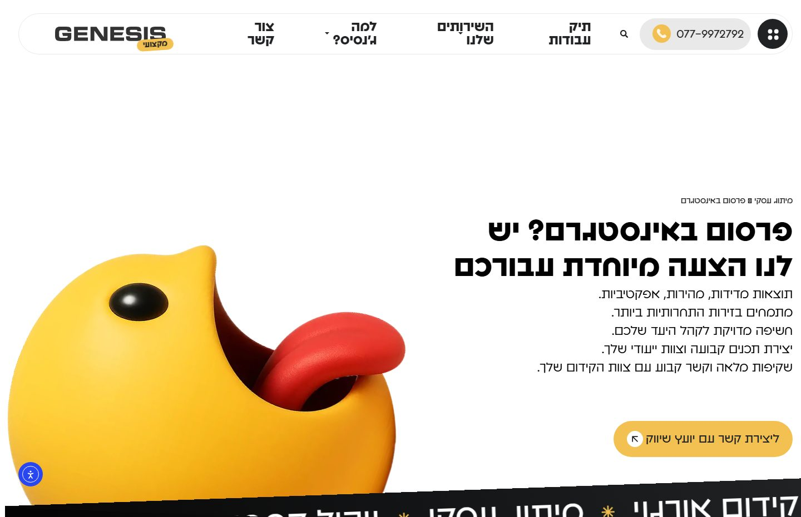 |
| 2 | content | 157 / — | `linear-gradient(249deg, #212224 0%, #000000 100%)` | 10 / 10 | 2 (16.5/17.6%) | — |  | 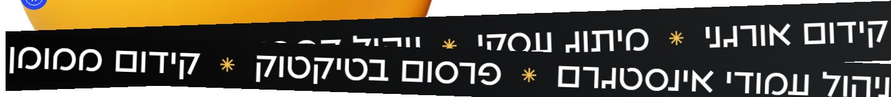 |
| 3 | content | 132 / — | `linear-gradient(249deg, #212224 0%, #000000 100%)` | 10 / 10 | 1 | — |  |  |
| 4 | testimonials | 1722 / 1516 | `#ffffff` | 0 / 0 | 1 | start | H2 103px 300 “לקוחות ממליצים” | 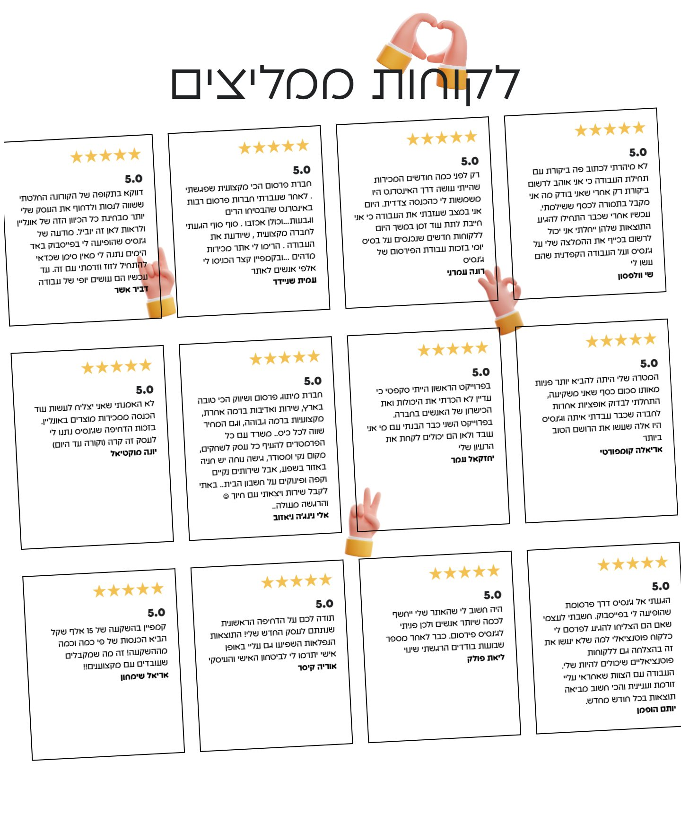 |
| 5 | content | 520 / 565 | `#ffffff` | 0 / 0 | 2 (46.1/46.1%) | start | H2 45px 700 “7 סיבות למה כדאי להשקיע בפרסום ממומן באינסטגרם לעסק שלך?” | 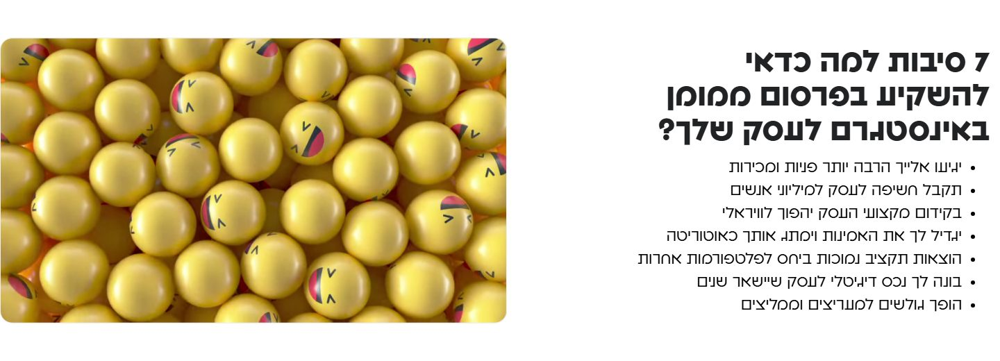 |
| 6 | content | 502 / 560 | `#ffffff` | 0 / 0 | 2 (46.1/46.1%) | start | H2 45px 700 “7 סיבות למה Genesis היא החברה הטובה ביותר עבורך” | 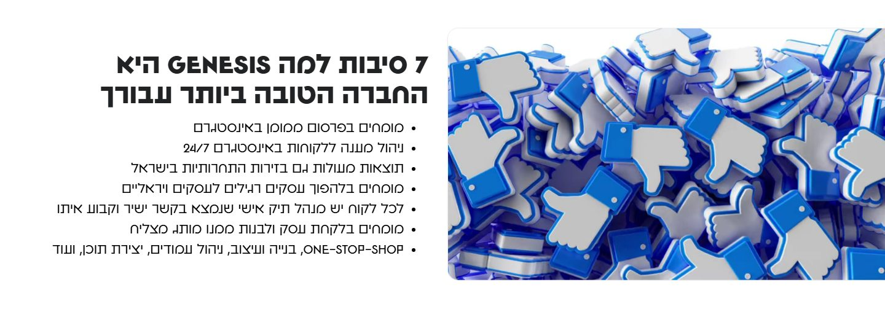 |
| 7 | content | 562 / 614 | `#ffffff` | 0 / 0 | 2 (46.1/46.1%) | start | H2 45px 700 “100% חשיפה, 100% רלוונטיות.” | 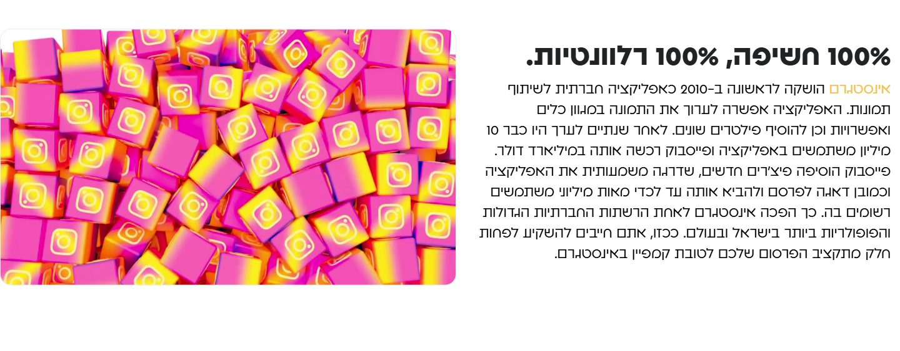 |
| 8 | content | 253 / 563 | `#212224` | 0 / 0 | 1 | start | H2 45px 700 “בכל פעם שהיד של ג'נסיס נוגעת בעסק שלך – הפוטנציאל צומח, והחש” |  |
| 9 | content | 431 / — | `#212224` | 0 / 0 | 1 | — |  |  |
| 10 | content | 562 / 507 | `#ffffff` | 0 / 0 | 2 (46.1/46.1%) | start | H2 45px 700 “אז למה בעצם לפרסם את העסק שלכם באינסטגרם?” | 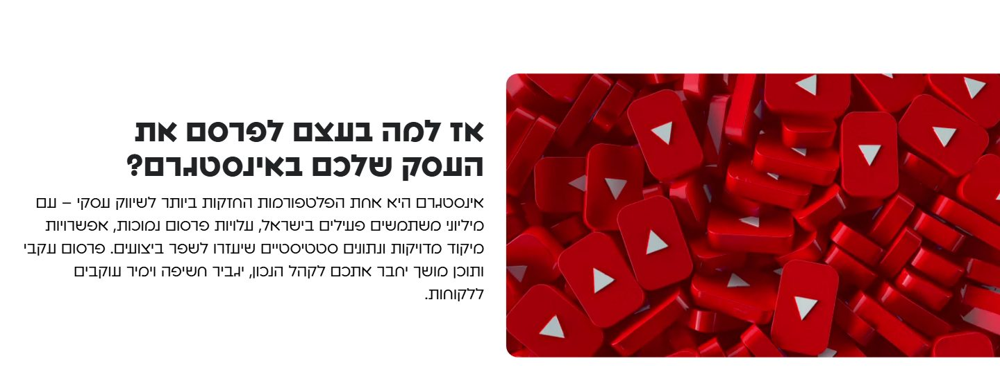 |
| 11 | content | 728 / 778 | `#ffffff` | 0 / 0 | 1 | start | H2 45px 700 “איך עושים את זה נכון?” | 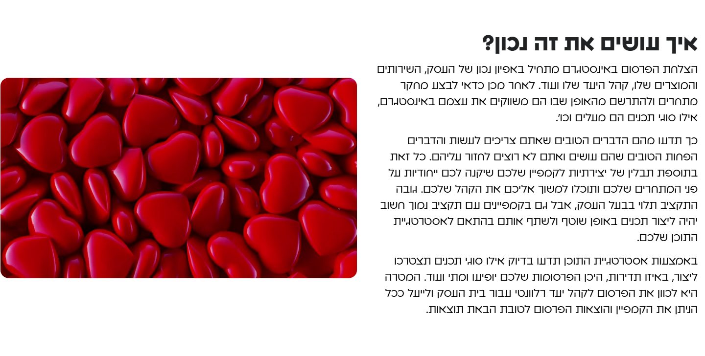 |
| 12 | content | 562 / 552 | `#ffffff` | 0 / 0 | 2 (46.1/46.1%) | start | H2 45px 700 “לצמוח באינסטגרם – עם תוכן נכון וקמפיינים ממוקדים” | 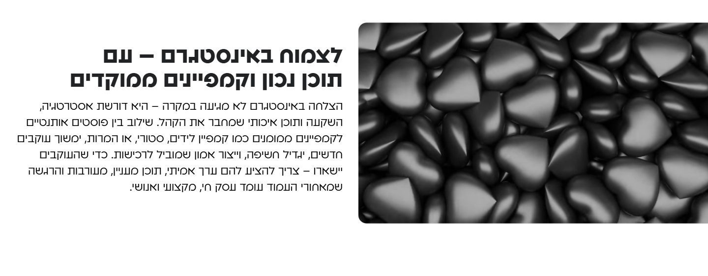 |
| 13 | form | 900 / 844 | `#ffffff` | 10 / 10 | 1 | center | H2 79px 700 “מוכנים לקשר רציני?” | 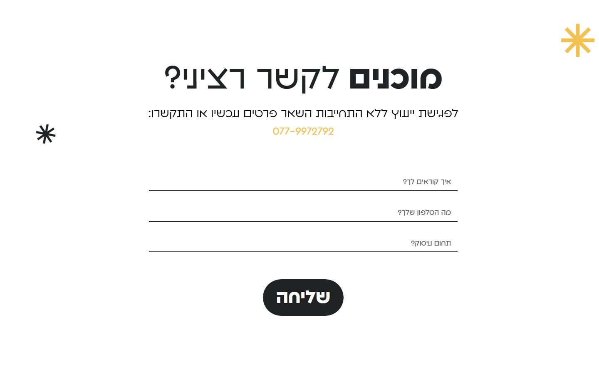 |
| 14 | content | 1761 / 1455 | `#ffffff` | 0 / 0 | 1 | start | H2 45px 700 “שאלות ותשובות” | 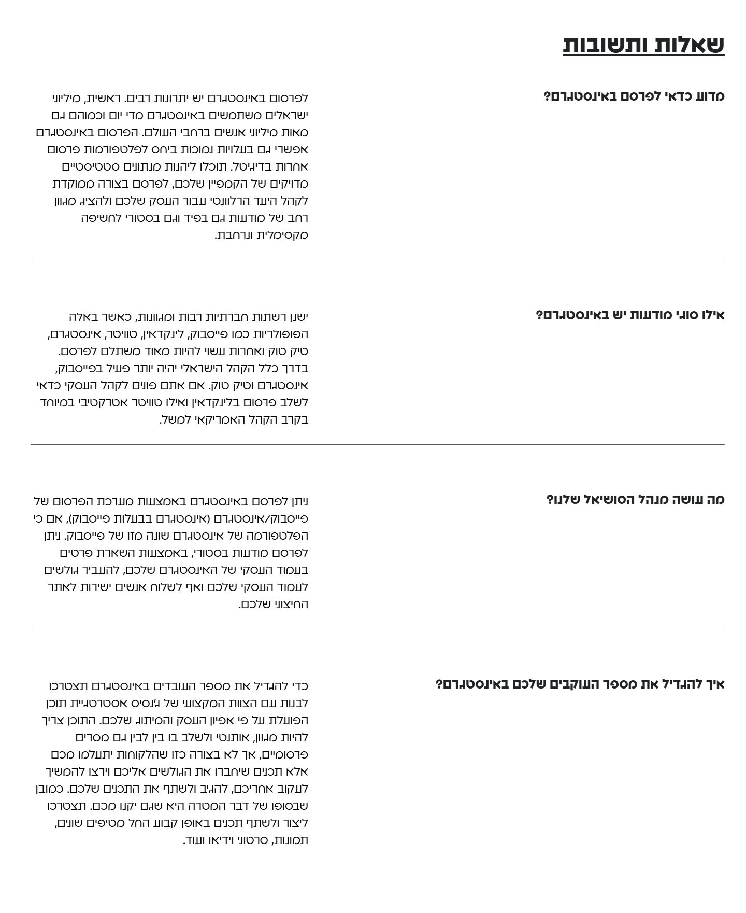 |
| 15 | footer | 400 / — | `#212224` | 0 / 0 | 4 (27.9/21.7/21.7/21.7%) | start |  |  |

Text outline: [pages/09-פרסום-באינסטגרם.md](pages/09-פרסום-באינסטגרם.md)

## 9. Sources & files

- Stylesheets: 52 files (+ inline <style> blocks) · 66881 rules · 4000 custom properties · 456 @font-face · 539 @keyframes
- Assets seen: font 5, stylesheet 52, image 1997, media 9 · saved locally: 80 MB (fonts/ and images/ are git-ignored)
- Cancelled by the browser (ERR_ABORTED — normal when a page closes; not a block): www.google.com ×319, cdn.gnss.co.il ×117, www.google-analytics.com ×55, analytics.google.com ×36, bzr.openai.com ×27, ad.doubleclick.net ×15, www.gnss.co.il ×9, www.google.co.il ×5
- Files: `tokens.json` (all measured tokens) · `tokens.css` (CSS variables) · `tailwind-theme.css` (Tailwind v4 @theme) · `data/raw.json` (every measurement) · `css/` (original stylesheets) · `pages/*.html` (rendered DOM) · `pages/*.md` (text outline)
